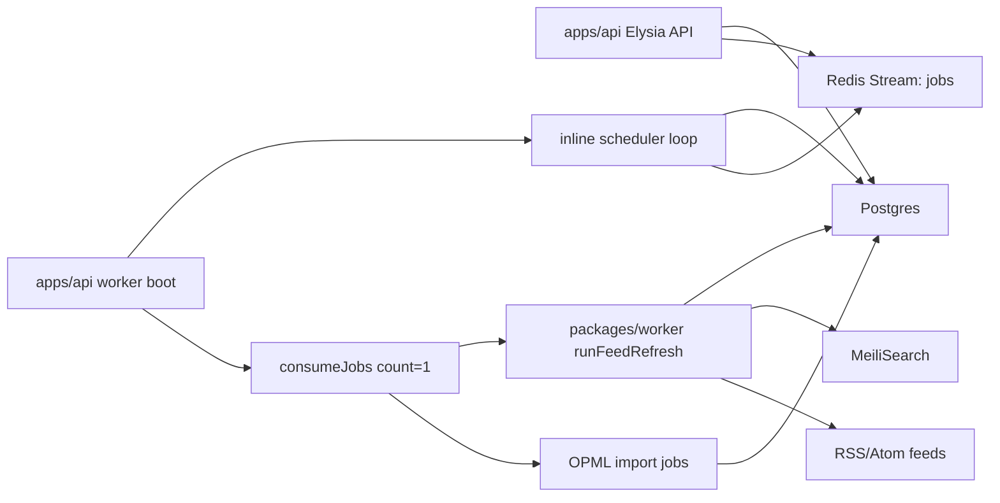
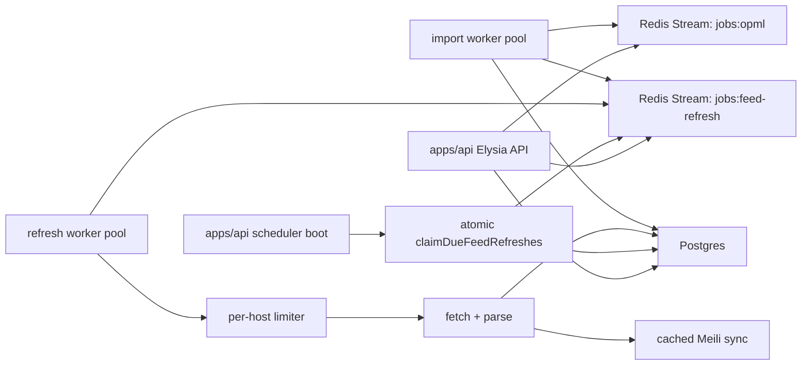

# Feed Refresh Scale Architecture Implementation Plan

> **For agentic workers:** Execute this plan in order. Do not skip the red test steps. Keep each commit checkpoint small enough to revert independently.

**Goal:** Make Kyomi's feed refresh pipeline understandable, observable, and safe to scale from the current single local worker shape to horizontally scaled workers and large feed catalogs.

**Architecture:** Split scheduling from execution, add atomic Postgres claims, add the missing read/scheduler indexes, bound Redis Stream growth, route long-running imports away from refresh jobs, and make worker concurrency/backpressure explicit.

**Tech Stack:** Bun, Elysia, Drizzle, Postgres, Redis Streams via ioredis, MeiliSearch, `bun test`.

**Review Status:** Drafted with `writing-plans`, then revised through CEO-style and plan-tune checks until the plan closed the known gaps: duplicate schedulers, non-atomic feed claims, missing indexes, unbounded streams, import/refresh contention, per-refresh work amplification, lack of scale observability, and production rollout risk.

---

## Current Architecture From Audit



Observed behavior:

- `docker/docker-compose.yml` has separate `api` and `worker` services, but the executable worker loop lives in `apps/api/src/app/jobs/run-worker.ts`; `packages/worker` is a shared worker library.
- `runWorkerLoop` starts `runScheduledFeedRefreshLoop` in every worker process. One worker is fine; N workers create N schedulers.
- Scheduler selection is non-atomic: it selects due feeds, then updates/publishes them one by one. There is no `FOR UPDATE SKIP LOCKED`, lease, queue de-dupe, or advisory singleton.
- Queue processing uses one Redis Stream, `jobs`, for `feed.refresh`, `opml.import`, and `opml.import.feed`. `consumeJobs` defaults to `count: 1`, sequential processing, `maxAttempts: 3`.
- Redis Streams are never trimmed, so acknowledged entries continue to occupy Redis memory.
- Feed queries and scheduler queries lack the indexes needed for large catalogs. Current schema has unique constraints but not operational indexes on refresh due dates, subscription fanout, or inbox sort/filter paths.
- Successful scheduled feed refreshes always set the next refresh to one hour. At 500K hourly feeds this implies about 139 refreshes/sec; at 1M hourly feeds, about 278 refreshes/sec. The current defaults enqueue at most dozens per minute.
- `runFeedRefresh` may also enrich newly inserted items and calls Meili sync after each refresh. That makes scheduled refresh cost vary by feed and can amplify downstream load.
- There is no per-host politeness limiter. A large refresh wave can overload a domain or get Kyomi blocked.

Primary discrepancies:

- Process model says API plus worker; implementation is API plus worker plus duplicated inline scheduler.
- Package model says `packages/worker` owns worker logic; production executable and scheduling policy are in `apps/api`.
- Queue model says durable background work; operational policy is single-stream, sequential, unbounded, and not partitioned by workload class.
- Database model says scale by due feed selection; schema does not provide the required indexes.
- Error logs make 404/certificate/feed-parser failures look like systemic worker failures; the system lacks classification and aggregate dashboards to distinguish expected feed churn from platform problems.

---

## Target Architecture



The most important invariant: every feed refresh job is created from either a user action or an atomic scheduler claim. Scaling the scheduler or worker count must not duplicate scheduled work.

---

## Global Constraints

- Keep `apps/api/src/modules/feeds/routes.ts` thin. New scheduler and queue policy code belongs under `apps/api/src/app/jobs/` or `packages/worker/src/services/queue/`.
- Keep normal setup independent from `packages/catalog`.
- Do not collapse API and worker deployment roles. Add a scheduler role instead of adding more hidden loops to worker startup.
- Keep fetch safety defaults: 12s timeout, 2MB response cap, Mozilla user agent with `VolsRssFeedFetcher/1.0`.
- Classify feed-owner failures as feed health data, not platform panics. HTTP 404, permanent 4xx, parser entity-limit failures, and certificate failures should be visible but should not bury worker health signals.
- Prefer reversible app changes before production data movement. Large production index creation must have an explicit concurrent-index runbook.
- Use `bunx`, not `npx`.

---

## Task List

- [ ] Task 1: Add scale-critical Postgres indexes and schema declarations.
- [ ] Task 2: Add Redis Stream routing, trimming, and configurable queue concurrency.
- [ ] Task 3: Move scheduled feed claiming into an atomic scheduler module.
- [ ] Task 4: Split scheduler and worker process roles.
- [ ] Task 5: Bound per-refresh amplification with cached search setup and host politeness.
- [ ] Task 6: Add operational visibility for queue lag, scheduler claims, and feed-error classes.
- [ ] Task 7: Run validation, load smoke checks, and document the rollout.

---

## Task 1: Add Scale-Critical Postgres Indexes

**Why:** At 500K+ feeds the scheduler query and inbox reads need index-backed access paths. Without them, the app will spend its capacity scanning and sorting.

### Files

- Create `packages/db/drizzle/0019_feed_refresh_scale_indexes.sql`
- Edit `packages/db/src/schema/feeds.ts`
- Edit `packages/db/src/schema/articles.ts`
- Create `tests/api/integration/db/feed-refresh-scale-indexes.test.ts`

### Red Test

Create `tests/api/integration/db/feed-refresh-scale-indexes.test.ts`:

```ts
import { readFileSync } from "node:fs";
import { join } from "node:path";
import { describe, expect, test } from "bun:test";

const migrationPath = join(
  import.meta.dir,
  "../../../../packages/db/drizzle/0019_feed_refresh_scale_indexes.sql",
);

describe("feed refresh scale indexes", () => {
  test("migration contains scheduler, subscription, inbox, and saved-item indexes", () => {
    const sql = readFileSync(migrationPath, "utf8");

    expect(sql).toContain("feeds_refresh_due_idx");
    expect(sql).toContain("feeds_refresh_status_idx");
    expect(sql).toContain("feed_subscriptions_feed_id_idx");
    expect(sql).toContain("feed_items_published_id_idx");
    expect(sql).toContain("feed_items_feed_published_id_idx");
    expect(sql).toContain("feed_item_user_state_saved_idx");
    expect(sql).toContain("article_clips_user_saved_created_idx");
  });
});
```

Run and confirm it fails because the migration does not exist:

```bash
bun test tests/api/integration/db/feed-refresh-scale-indexes.test.ts
```

### Green Implementation

Create `packages/db/drizzle/0019_feed_refresh_scale_indexes.sql`:

```sql
CREATE INDEX IF NOT EXISTS "feeds_refresh_due_idx"
  ON "feeds" ("next_refresh_at", "id")
  WHERE "refresh_status" NOT IN ('running', 'queued');

CREATE INDEX IF NOT EXISTS "feeds_refresh_status_idx"
  ON "feeds" ("refresh_status", "id");

CREATE INDEX IF NOT EXISTS "feed_subscriptions_feed_id_idx"
  ON "feed_subscriptions" ("feed_id");

CREATE INDEX IF NOT EXISTS "feed_items_published_id_idx"
  ON "feed_items" ("published_at" DESC, "id" DESC);

CREATE INDEX IF NOT EXISTS "feed_items_feed_published_id_idx"
  ON "feed_items" ("feed_id", "published_at" DESC, "id" DESC);

CREATE INDEX IF NOT EXISTS "feed_item_user_state_saved_idx"
  ON "feed_item_user_state" ("user_id", "is_saved", "feed_item_id")
  WHERE "is_saved" IS TRUE;

CREATE INDEX IF NOT EXISTS "article_clips_user_saved_created_idx"
  ON "article_clips" ("user_id", "is_saved", "created_at" DESC, "id" DESC)
  WHERE "is_saved" IS TRUE;
```

Edit `packages/db/src/schema/feeds.ts`:

- Add `index` to the `drizzle-orm/pg-core` import.
- Add `sql` from `drizzle-orm`.
- Add these index declarations inside the existing `feeds` table callback:

```ts
feedsRefreshDueIdx: index("feeds_refresh_due_idx")
  .on(table.nextRefreshAt, table.id)
  .where(sql`${table.refreshStatus} NOT IN ('running', 'queued')`),
feedsRefreshStatusIdx: index("feeds_refresh_status_idx").on(table.refreshStatus, table.id),
```

- Add this index declaration inside the existing `feedSubscriptions` table callback:

```ts
feedSubscriptionsFeedIdIdx: index("feed_subscriptions_feed_id_idx").on(table.feedId),
```

Edit `packages/db/src/schema/articles.ts`:

- Add `index` to the `drizzle-orm/pg-core` import.
- Add `sql` from `drizzle-orm`.
- Add these index declarations inside `feedItems`:

```ts
feedItemsPublishedIdIdx: index("feed_items_published_id_idx").on(
  table.publishedAt.desc(),
  table.id.desc(),
),
feedItemsFeedPublishedIdIdx: index("feed_items_feed_published_id_idx").on(
  table.feedId,
  table.publishedAt.desc(),
  table.id.desc(),
),
```

- Add this declaration inside `feedItemUserState`:

```ts
feedItemUserStateSavedIdx: index("feed_item_user_state_saved_idx")
  .on(table.userId, table.isSaved, table.feedItemId)
  .where(sql`${table.isSaved} IS TRUE`),
```

- Add this declaration inside `articleClips`:

```ts
articleClipsUserSavedCreatedIdx: index("article_clips_user_saved_created_idx")
  .on(table.userId, table.isSaved, table.createdAt.desc(), table.id.desc())
  .where(sql`${table.isSaved} IS TRUE`),
```

### Validation

```bash
bun test tests/api/integration/db/feed-refresh-scale-indexes.test.ts
bunx tsgo -p packages/db/tsconfig.json --noEmit
```

For production databases with large existing tables, do not use the non-concurrent migration during peak traffic. Run this concurrent variant manually before the app rollout:

```sql
CREATE INDEX CONCURRENTLY IF NOT EXISTS "feeds_refresh_due_idx"
  ON "feeds" ("next_refresh_at", "id")
  WHERE "refresh_status" NOT IN ('running', 'queued');
CREATE INDEX CONCURRENTLY IF NOT EXISTS "feeds_refresh_status_idx"
  ON "feeds" ("refresh_status", "id");
CREATE INDEX CONCURRENTLY IF NOT EXISTS "feed_subscriptions_feed_id_idx"
  ON "feed_subscriptions" ("feed_id");
CREATE INDEX CONCURRENTLY IF NOT EXISTS "feed_items_published_id_idx"
  ON "feed_items" ("published_at" DESC, "id" DESC);
CREATE INDEX CONCURRENTLY IF NOT EXISTS "feed_items_feed_published_id_idx"
  ON "feed_items" ("feed_id", "published_at" DESC, "id" DESC);
CREATE INDEX CONCURRENTLY IF NOT EXISTS "feed_item_user_state_saved_idx"
  ON "feed_item_user_state" ("user_id", "is_saved", "feed_item_id")
  WHERE "is_saved" IS TRUE;
CREATE INDEX CONCURRENTLY IF NOT EXISTS "article_clips_user_saved_created_idx"
  ON "article_clips" ("user_id", "is_saved", "created_at" DESC, "id" DESC)
  WHERE "is_saved" IS TRUE;
```

### Commit Checkpoint

```bash
git add packages/db/drizzle/0019_feed_refresh_scale_indexes.sql packages/db/src/schema/feeds.ts packages/db/src/schema/articles.ts tests/api/integration/db/feed-refresh-scale-indexes.test.ts
git commit -m "Add feed refresh scale indexes"
```

---

## Task 2: Add Redis Stream Routing, Trimming, and Queue Concurrency

**Why:** A single unbounded sequential stream cannot scale and lets large OPML imports compete directly with scheduled refreshes.

### Files

- Edit `packages/worker/src/services/queue/job.ts`
- Edit `packages/worker/src/index.ts` if queue exports are centralized there
- Create `tests/api/integration/services/queue/job-routing.test.ts`

### Red Tests

Create `tests/api/integration/services/queue/job-routing.test.ts`:

```ts
import { describe, expect, test } from "bun:test";
import {
  FEED_REFRESH_JOBS_STREAM_KEY,
  OPML_JOBS_STREAM_KEY,
  getStreamKeyForJobType,
  normalizeQueueOptions,
} from "@kyomi/worker";

describe("queue routing", () => {
  test("routes feed refresh jobs separately from OPML jobs", () => {
    expect(getStreamKeyForJobType("feed.refresh")).toBe(FEED_REFRESH_JOBS_STREAM_KEY);
    expect(getStreamKeyForJobType("opml.import")).toBe(OPML_JOBS_STREAM_KEY);
    expect(getStreamKeyForJobType("opml.import.feed")).toBe(OPML_JOBS_STREAM_KEY);
  });

  test("normalizes stream trimming and bounded concurrency defaults", () => {
    expect(normalizeQueueOptions({}).streamMaxLength).toBe(100_000);
    expect(normalizeQueueOptions({ processConcurrency: 0 }).processConcurrency).toBe(1);
    expect(normalizeQueueOptions({ processConcurrency: 1000 }).processConcurrency).toBe(64);
  });
});
```

Run and confirm it fails because the exports do not exist:

```bash
bun test tests/api/integration/services/queue/job-routing.test.ts
```

### Green Implementation

In `packages/worker/src/services/queue/job.ts`, replace the single public stream constant with workload-specific constants while keeping a compatibility alias:

```ts
export const FEED_REFRESH_JOBS_STREAM_KEY = "jobs:feed-refresh";
export const OPML_JOBS_STREAM_KEY = "jobs:opml";
export const JOBS_STREAM_KEY = FEED_REFRESH_JOBS_STREAM_KEY;

export const JOBS_CONSUMER_GROUP = "kyomi-workers";
export const JOBS_DEAD_LETTER_STREAM_KEY = "jobs:dead-letter";

export function getStreamKeyForJobType(jobType: JobType): string {
  switch (jobType) {
    case "feed.refresh":
      return FEED_REFRESH_JOBS_STREAM_KEY;
    case "opml.import":
    case "opml.import.feed":
      return OPML_JOBS_STREAM_KEY;
  }
}
```

Add queue option normalization:

```ts
export type QueueOptions = {
  streamKey?: string;
  streamMaxLength?: number;
  processConcurrency?: number;
};

export function normalizeQueueOptions(options: QueueOptions = {}) {
  return {
    streamKey: options.streamKey,
    streamMaxLength: Math.min(Math.max(options.streamMaxLength ?? 100_000, 1_000), 5_000_000),
    processConcurrency: Math.min(Math.max(options.processConcurrency ?? 1, 1), 64),
  };
}
```

Change job publishing so every `XADD` uses the routed stream and approximate trimming:

```ts
const queueOptions = normalizeQueueOptions(options);
const streamKey = queueOptions.streamKey ?? getStreamKeyForJobType(job.type);

await redis.xadd(
  streamKey,
  "MAXLEN",
  "~",
  queueOptions.streamMaxLength,
  "*",
  "payload",
  JSON.stringify(job),
);
```

Change consumer setup so it creates the configured consumer group for each stream the process consumes. Preserve compatibility with existing pending entries by letting `ensureConsumerGroup` accept a stream key:

```ts
export async function ensureConsumerGroup(redis: Redis, streamKey: string) {
  try {
    await redis.xgroup("CREATE", streamKey, JOBS_CONSUMER_GROUP, "0", "MKSTREAM");
  } catch (error) {
    if (!isBusyGroupError(error)) {
      throw error;
    }
  }
}
```

Change message processing to bounded concurrency. Use the existing job handler function; only alter dispatch:

```ts
async function processMessagesWithConcurrency(
  messages: QueueMessage[],
  concurrency: number,
  processOne: (message: QueueMessage) => Promise<void>,
) {
  const executing = new Set<Promise<void>>();

  for (const message of messages) {
    const task = processOne(message).finally(() => executing.delete(task));
    executing.add(task);

    if (executing.size >= concurrency) {
      await Promise.race(executing);
    }
  }

  await Promise.all(executing);
}
```

Expose `getStreamKeyForJobType`, `FEED_REFRESH_JOBS_STREAM_KEY`, `OPML_JOBS_STREAM_KEY`, and `normalizeQueueOptions` from the package export surface used by tests and `apps/api`.

In `apps/api/src/app/jobs/run-worker.ts`, parse `env.JOB_STREAMS` as a comma-delimited list with this default:

```ts
const jobStreams = env.JOB_STREAMS.length > 0
  ? env.JOB_STREAMS
  : [FEED_REFRESH_JOBS_STREAM_KEY, OPML_JOBS_STREAM_KEY];
```

Start one consumer loop per stream with the same job handler but separate read cursors:

```ts
await Promise.all(
  jobStreams.map((streamKey) =>
    consumeJobs(redis, handleJob, {
      streamKey,
      count: env.JOB_READ_COUNT,
      processConcurrency: env.JOB_PROCESS_CONCURRENCY,
      streamMaxLength: env.JOB_STREAM_MAX_LENGTH,
      signal,
    }),
  ),
);
```

### Validation

```bash
bun test tests/api/integration/services/queue/job-routing.test.ts
bunx tsgo -p packages/worker/tsconfig.json --noEmit
```

### Commit Checkpoint

```bash
git add packages/worker/src/services/queue/job.ts packages/worker/src/index.ts tests/api/integration/services/queue/job-routing.test.ts
git commit -m "Add routed bounded Redis job queues"
```

---

## Task 3: Move Scheduled Feed Claiming Into an Atomic Scheduler Module

**Why:** The current scheduler can duplicate claims across workers and does not scale safely. The scheduler needs a single atomic DB operation that claims due feeds and returns the claimed IDs.

### Files

- Create `apps/api/src/app/jobs/refresh-scheduler.ts`
- Edit `apps/api/src/app/jobs/run-worker.ts`
- Create `tests/api/integration/app/jobs/refresh-scheduler.test.ts`

### Red Tests

Create `tests/api/integration/app/jobs/refresh-scheduler.test.ts` with two tests:

```ts
import { readFileSync } from "node:fs";
import { join } from "node:path";
import { describe, expect, test } from "bun:test";
import { normalizeSchedulerOptions } from "@/app/jobs/refresh-scheduler";

const schedulerSourcePath = join(
  import.meta.dir,
  "../../../../apps/api/src/app/jobs/refresh-scheduler.ts",
);

describe("feed refresh scheduler", () => {
  test("claim SQL uses row locks, skip locked, stale claim recovery, and queued state", () => {
    const source = readFileSync(schedulerSourcePath, "utf8");

    expect(source).toContain("FOR UPDATE SKIP LOCKED");
    expect(source).toContain("refresh_status = 'queued'");
    expect(source).toContain("staleQueuedBefore");
    expect(source).toContain("releaseUnpublishedFeedRefreshClaims");
  });

  test("normalizes scheduler limits", () => {
    expect(normalizeSchedulerOptions({}).subscribedLimit).toBe(50);
    expect(normalizeSchedulerOptions({ globalLimit: 10_000 }).globalLimit).toBe(1_000);
    expect(normalizeSchedulerOptions({ maxQueuedRefreshJobs: 0 }).maxQueuedRefreshJobs).toBe(1);
    expect(normalizeSchedulerOptions({ queuedLeaseMs: 1 }).queuedLeaseMs).toBe(60_000);
  });
});
```

The test imports use the existing test alias pattern. If the API tests do not resolve `@/`, import `normalizeSchedulerOptions` with the same relative style used by existing `tests/api/integration/app/**` files.

Run and confirm it fails:

```bash
bun test tests/api/integration/app/jobs/refresh-scheduler.test.ts
```

### Green Implementation

Create `apps/api/src/app/jobs/refresh-scheduler.ts`:

```ts
import { inArray, sql } from "drizzle-orm";
import type { Redis } from "ioredis";
import { feeds } from "@kyomi/db/schema";
import { publishJob } from "@kyomi/worker";
import { db } from "@/database";
import { env } from "@/config/env";
import { logger } from "@/lib/logger";

export type FeedRefreshScheduleReason = "scheduled" | "global_scheduled";

export type ClaimedFeedRefresh = {
  feedId: string;
  reason: FeedRefreshScheduleReason;
};

export type SchedulerOptions = {
  subscribedLimit?: number;
  globalLimit?: number;
  maxQueuedRefreshJobs?: number;
  queuedLeaseMs?: number;
  runningLeaseMs?: number;
  tickMs?: number;
};

export function normalizeSchedulerOptions(options: SchedulerOptions = {}) {
  return {
    subscribedLimit: Math.min(Math.max(options.subscribedLimit ?? 50, 1), 5_000),
    globalLimit: Math.min(Math.max(options.globalLimit ?? 10, 0), 1_000),
    maxQueuedRefreshJobs: Math.min(Math.max(options.maxQueuedRefreshJobs ?? 25, 1), 1_000_000),
    queuedLeaseMs: Math.min(Math.max(options.queuedLeaseMs ?? 15 * 60_000, 60_000), 24 * 60 * 60_000),
    runningLeaseMs: Math.min(Math.max(options.runningLeaseMs ?? 30 * 60_000, 60_000), 24 * 60 * 60_000),
    tickMs: Math.min(Math.max(options.tickMs ?? 60_000, 1_000), 3_600_000),
  };
}
```

Add a query builder that test code can inspect:

```ts
export function buildFeedRefreshClaimSql(input: {
  now: Date;
  staleQueuedBefore: Date;
  staleRunningBefore: Date;
  subscribedLimit: number;
  globalLimit: number;
}) {
  return sql<ClaimedFeedRefresh>`
    WITH subscribed_due AS (
      SELECT f.id, 'scheduled'::text AS reason
      FROM feeds f
      WHERE EXISTS (
        SELECT 1 FROM feed_subscriptions fs WHERE fs.feed_id = f.id
      )
        AND (f.next_refresh_at IS NULL OR f.next_refresh_at <= ${input.now})
        AND (
          f.refresh_status NOT IN ('running', 'queued')
          OR (f.refresh_status = 'queued' AND f.updated_at <= ${input.staleQueuedBefore})
          OR (f.refresh_status = 'running' AND f.updated_at <= ${input.staleRunningBefore})
        )
      ORDER BY f.next_refresh_at NULLS FIRST, f.id
      FOR UPDATE SKIP LOCKED
      LIMIT ${input.subscribedLimit}
    ),
    global_due AS (
      SELECT f.id, 'global_scheduled'::text AS reason
      FROM feeds f
      WHERE ${input.globalLimit} > 0
        AND NOT EXISTS (
          SELECT 1 FROM feed_subscriptions fs WHERE fs.feed_id = f.id
        )
        AND (f.next_refresh_at IS NULL OR f.next_refresh_at <= ${input.now})
        AND (
          f.refresh_status NOT IN ('running', 'queued')
          OR (f.refresh_status = 'queued' AND f.updated_at <= ${input.staleQueuedBefore})
          OR (f.refresh_status = 'running' AND f.updated_at <= ${input.staleRunningBefore})
        )
      ORDER BY f.next_refresh_at NULLS FIRST, f.id
      FOR UPDATE SKIP LOCKED
      LIMIT ${input.globalLimit}
    ),
    claimed AS (
      SELECT * FROM subscribed_due
      UNION ALL
      SELECT * FROM global_due
    )
    UPDATE feeds
    SET refresh_status = 'queued',
        last_refresh_error = NULL,
        updated_at = ${input.now}
    FROM claimed
    WHERE feeds.id = claimed.id
    RETURNING feeds.id AS "feedId", claimed.reason AS reason
  `;
}
```

Add result normalization because Drizzle/Postgres driver result shapes differ between direct and pooled calls:

```ts
function rowsFromExecute<T>(result: unknown): T[] {
  if (Array.isArray(result)) {
    return result as T[];
  }

  if (result && typeof result === "object" && "rows" in result) {
    return (result as { rows: T[] }).rows;
  }

  return [];
}
```

Add the atomic claim function:

```ts
export async function claimDueFeedRefreshes(
  options: SchedulerOptions = {},
  now = new Date(),
): Promise<ClaimedFeedRefresh[]> {
  const normalized = normalizeSchedulerOptions(options);
  const staleQueuedBefore = new Date(now.getTime() - normalized.queuedLeaseMs);
  const staleRunningBefore = new Date(now.getTime() - normalized.runningLeaseMs);

  const result = await db.execute(
    buildFeedRefreshClaimSql({
      now,
      staleQueuedBefore,
      staleRunningBefore,
      subscribedLimit: normalized.subscribedLimit,
      globalLimit: normalized.globalLimit,
    }),
  );

  return rowsFromExecute<ClaimedFeedRefresh>(result);
}
```

Add the publish step. This accepts claimed rows only; it does not select feeds:

```ts
export async function publishClaimedFeedRefreshes(
  redis: Redis,
  claimed: ClaimedFeedRefresh[],
) {
  const unpublishedFeedIds: string[] = [];

  for (const feed of claimed) {
    try {
      await publishJob(redis, {
        type: "feed.refresh",
        payload: {
          feedId: feed.feedId,
          userId: "system",
          reason: feed.reason,
        },
      });
    } catch (error) {
      unpublishedFeedIds.push(feed.feedId);
      logger.error({
        event: "feed.scheduler.publish_failed",
        feedId: feed.feedId,
        error: error instanceof Error ? error.message : String(error),
      });
    }
  }

  if (unpublishedFeedIds.length > 0) {
    await releaseUnpublishedFeedRefreshClaims(unpublishedFeedIds);
  }
}
```

Add claim release for known publish failures:

```ts
export async function releaseUnpublishedFeedRefreshClaims(feedIds: string[]) {
  if (feedIds.length === 0) {
    return;
  }

  await db
    .update(feeds)
    .set({
      refreshStatus: "idle",
      lastRefreshError: "Feed refresh enqueue failed",
      updatedAt: new Date(),
    })
    .where(inArray(feeds.id, feedIds));
}
```

The stale `queued` and stale `running` lease conditions in `buildFeedRefreshClaimSql` handle ambiguous failures where Redis accepted the publish but the scheduler did not receive a success response.

Add the loop:

```ts
export async function runFeedRefreshSchedulerLoop(redis: Redis, signal?: AbortSignal) {
  const options = normalizeSchedulerOptions({
    subscribedLimit: env.SUBSCRIBED_FEED_REFRESH_BATCH_SIZE,
    globalLimit: env.GLOBAL_FEED_REFRESH_BATCH_SIZE,
    maxQueuedRefreshJobs: env.GLOBAL_FEED_REFRESH_MAX_QUEUED,
    queuedLeaseMs: env.FEED_REFRESH_QUEUED_LEASE_MS,
    runningLeaseMs: env.FEED_REFRESH_RUNNING_LEASE_MS,
  });

  logger.info({ event: "feed.scheduler.started", options });

  while (!signal?.aborted) {
    try {
      const queuedCount = await countQueuedFeedRefreshes();

      if (queuedCount < options.maxQueuedRefreshJobs) {
        const remainingCapacity = options.maxQueuedRefreshJobs - queuedCount;
        const claimed = await claimDueFeedRefreshes({
          ...options,
          subscribedLimit: Math.min(options.subscribedLimit, remainingCapacity),
          globalLimit: Math.min(options.globalLimit, remainingCapacity),
        });

        await publishClaimedFeedRefreshes(redis, claimed);

        logger.info({
          event: "feed.scheduler.claimed",
          claimed: claimed.length,
          queuedCount,
        });
      }
    } catch (error) {
      logger.error({ event: "feed.scheduler.failed", error: error instanceof Error ? error.message : String(error) });
    }

    await Bun.sleep(options.tickMs);
  }
}
```

Implement `countQueuedFeedRefreshes()` from Postgres lifecycle state. Do not use `XLEN` for scheduler backpressure because stream length includes historical entries until trimming runs and can include pending entries already counted by the consumer group:

```ts
export async function countQueuedFeedRefreshes() {
  const result = await db.execute(sql<{ count: number }>`
    SELECT count(*)::int AS count
    FROM feeds
    WHERE refresh_status = 'queued'
  `);

  return rowsFromExecute<{ count: number }>(result)[0]?.count ?? 0;
}
```

Remove the old scheduler select/update logic from `apps/api/src/app/jobs/run-worker.ts`. Keep job handling there, but import `runFeedRefreshSchedulerLoop` from the new module only where needed by boot code in Task 4.

### Validation

```bash
bun test tests/api/integration/app/jobs/refresh-scheduler.test.ts
bun run --cwd apps/api typecheck
```

### Commit Checkpoint

```bash
git add apps/api/src/app/jobs/refresh-scheduler.ts apps/api/src/app/jobs/run-worker.ts tests/api/integration/app/jobs/refresh-scheduler.test.ts
git commit -m "Claim scheduled feed refreshes atomically"
```

---

## Task 4: Split Scheduler and Worker Process Roles

**Why:** Horizontal worker scaling must increase execution capacity without multiplying schedulers. The scheduler needs its own process role.

### Files

- Create `apps/api/src/app/boot/scheduler.ts`
- Edit `apps/api/src/app/boot/worker.ts`
- Edit `apps/api/src/app/boot/dev.ts`
- Edit `apps/api/package.json`
- Edit `docker/docker-compose.yml`
- Edit `apps/api/src/config/env/index.ts`
- Create `tests/api/integration/app/jobs/process-roles.test.ts`

### Red Test

Create `tests/api/integration/app/jobs/process-roles.test.ts`:

```ts
import { readFileSync } from "node:fs";
import { join } from "node:path";
import { describe, expect, test } from "bun:test";

const root = join(import.meta.dir, "../../../..");

describe("process roles", () => {
  test("worker boot does not start the scheduler", () => {
    const workerBoot = readFileSync(join(root, "apps/api/src/app/boot/worker.ts"), "utf8");
    expect(workerBoot).not.toContain("runFeedRefreshSchedulerLoop");
  });

  test("scheduler boot starts only the scheduler", () => {
    const schedulerBoot = readFileSync(join(root, "apps/api/src/app/boot/scheduler.ts"), "utf8");
    expect(schedulerBoot).toContain("runFeedRefreshSchedulerLoop");
    expect(schedulerBoot).not.toContain("runWorkerLoop");
  });

  test("compose defines separate worker and scheduler services", () => {
    const compose = readFileSync(join(root, "docker/docker-compose.yml"), "utf8");
    expect(compose).toContain("worker:");
    expect(compose).toContain("scheduler:");
  });
});
```

Run and confirm it fails before edits:

```bash
bun test tests/api/integration/app/jobs/process-roles.test.ts
```

### Green Implementation

Create `apps/api/src/app/boot/scheduler.ts`:

```ts
import { createRedisClient } from "@/redis/client";
import { runFeedRefreshSchedulerLoop } from "@/app/jobs/refresh-scheduler";
import { logger } from "@/lib/logger";

const controller = new AbortController();
const redis = createRedisClient();

process.once("SIGINT", () => controller.abort());
process.once("SIGTERM", () => controller.abort());

try {
  await runFeedRefreshSchedulerLoop(redis, controller.signal);
} catch (error) {
  logger.error({
    event: "scheduler.boot.failed",
    error: error instanceof Error ? error.message : String(error),
  });
  process.exitCode = 1;
} finally {
  await redis.quit();
}
```

Edit `apps/api/src/app/boot/worker.ts` so it calls only `runWorkerLoop`.

Edit `apps/api/src/app/boot/dev.ts` so local development starts API, worker, and scheduler with shared shutdown:

```ts
void runWorkerLoop(redis, controller.signal);
void runFeedRefreshSchedulerLoop(redis, controller.signal);
```

Keep this local-only co-location in `dev.ts`; do not put scheduler startup inside `runWorkerLoop`.

Edit `apps/api/package.json`:

```json
{
  "scripts": {
    "worker": "bunx dotenvx run -f ../../docker/.env -f .env -- bun src/app/boot/worker.ts",
    "scheduler": "bunx dotenvx run -f ../../docker/.env -f .env -- bun src/app/boot/scheduler.ts"
  }
}
```

Edit `docker/docker-compose.yml`:

```yaml
  worker:
    command: bun run --cwd apps/api worker
    environment:
      JOB_STREAMS: jobs:feed-refresh,jobs:opml

  scheduler:
    build:
      context: ..
      dockerfile: docker/Dockerfile
    command: bun run --cwd apps/api scheduler
    depends_on:
      postgres:
        condition: service_healthy
      redis:
        condition: service_started
    env_file:
      - .env
      - ../apps/api/.env
```

If the compose file uses shared anchors for `api` and `worker`, reuse the existing anchor instead of duplicating build/env boilerplate.

Edit `apps/api/src/config/env/index.ts`:

- Add `SUBSCRIBED_FEED_REFRESH_BATCH_SIZE`, default `50`, max `5_000`.
- Keep `GLOBAL_FEED_REFRESH_BATCH_SIZE`, but max it at `1_000`.
- Keep `GLOBAL_FEED_REFRESH_MAX_QUEUED`, but max it at `1_000_000`.
- Add `JOB_PROCESS_CONCURRENCY`, default `4`, max `64`.
- Add `JOB_READ_COUNT`, default `10`, max `256`.
- Add `JOB_STREAM_MAX_LENGTH`, default `100_000`, max `5_000_000`.
- Add `JOB_STREAMS`, default `["jobs:feed-refresh", "jobs:opml"]` after parsing a comma-delimited env string.
- Add `FEED_REFRESH_QUEUED_LEASE_MS`, default `900000`, min `60000`, max `86400000`.
- Add `FEED_REFRESH_RUNNING_LEASE_MS`, default `1800000`, min `60000`, max `86400000`.
- Add `FEED_FETCH_HOST_LEASE_MS`, default `5000`, min `1000`, max `60000`.
- Add `FEED_FETCH_HOST_RETRY_DELAY_MS`, default `250`, min `10`, max `5000`.

### Validation

```bash
bun test tests/api/integration/app/jobs/process-roles.test.ts
bun run --cwd apps/api typecheck
docker compose -f docker/docker-compose.yml config
```

### Commit Checkpoint

```bash
git add apps/api/src/app/boot/scheduler.ts apps/api/src/app/boot/worker.ts apps/api/src/app/boot/dev.ts apps/api/package.json apps/api/src/config/env/index.ts docker/docker-compose.yml tests/api/integration/app/jobs/process-roles.test.ts
git commit -m "Split scheduler and worker process roles"
```

---

## Task 5: Bound Per-Refresh Amplification

**Why:** Scaling refresh count is not enough if each refresh can fan out into repeated search setup, enrichment work, and unbounded same-host requests.

### Files

- Edit `packages/worker/src/services/feed/refresh.ts`
- Edit `packages/worker/src/services/feed/fetch.ts`
- Edit `packages/worker/src/services/feed/index.ts`
- Edit `packages/worker/src/services/feed/search.ts`
- Edit `apps/api/src/app/jobs/run-worker.ts`
- Create `packages/worker/src/services/feed/host-rate-limit.ts`
- Create `tests/api/integration/modules/feeds/host-rate-limit.test.ts`
- Create `tests/api/integration/modules/feeds/feed-refresh-policy.test.ts`

### Red Tests

Create `tests/api/integration/modules/feeds/host-rate-limit.test.ts`:

```ts
import { describe, expect, test } from "bun:test";
import {
  createHostRateLimiter,
  createMemoryHostRateLimitStore,
} from "@kyomi/worker/ingestion";

describe("host rate limiter", () => {
  test("serializes same-host work across limiter instances sharing one store", async () => {
    const store = createMemoryHostRateLimitStore();
    const limiterA = createHostRateLimiter({ store, leaseMs: 1_000, retryDelayMs: 1 });
    const limiterB = createHostRateLimiter({ store, leaseMs: 1_000, retryDelayMs: 1 });
    const events: string[] = [];

    await Promise.all([
      limiterA.run("https://example.com/a.xml", async () => {
        events.push("a:start");
        await Bun.sleep(10);
        events.push("a:end");
      }),
      limiterB.run("https://example.com/b.xml", async () => {
        events.push("b:start");
        events.push("b:end");
      }),
    ]);

    expect(events).toEqual(["a:start", "a:end", "b:start", "b:end"]);
  });
});
```

Create `tests/api/integration/modules/feeds/feed-refresh-policy.test.ts`:

```ts
import { describe, expect, test } from "bun:test";
import { shouldEnrichInsertedItems } from "@kyomi/worker/ingestion";

describe("feed refresh policy", () => {
  test("does not enrich scheduled system refreshes by default", () => {
    expect(shouldEnrichInsertedItems({ userId: "system", reason: "scheduled" })).toBe(false);
    expect(shouldEnrichInsertedItems({ userId: "system", reason: "global_scheduled" })).toBe(false);
  });

  test("keeps user-triggered refresh enrichment enabled", () => {
    expect(shouldEnrichInsertedItems({ userId: "user_123", reason: "manual" })).toBe(true);
  });
});
```

Run and confirm failures:

```bash
bun test tests/api/integration/modules/feeds/host-rate-limit.test.ts tests/api/integration/modules/feeds/feed-refresh-policy.test.ts
```

### Green Implementation

Create `packages/worker/src/services/feed/host-rate-limit.ts`:

```ts
import type { Redis } from "ioredis";

export type HostRateLimitStore = {
  acquire(key: string, token: string, ttlMs: number): Promise<boolean>;
  release(key: string, token: string): Promise<void>;
};

export type HostRateLimiterOptions = {
  store: HostRateLimitStore;
  leaseMs?: number;
  retryDelayMs?: number;
  sleep?: (ms: number) => Promise<void>;
};

export function createMemoryHostRateLimitStore(now = () => Date.now()): HostRateLimitStore {
  const locks = new Map<string, { token: string; expiresAt: number }>();

  return {
    async acquire(key, token, ttlMs) {
      const existing = locks.get(key);

      if (existing && existing.expiresAt > now()) {
        return false;
      }

      locks.set(key, { token, expiresAt: now() + ttlMs });
      return true;
    },
    async release(key, token) {
      if (locks.get(key)?.token === token) {
        locks.delete(key);
      }
    },
  };
}

export function createRedisHostRateLimitStore(redis: Redis): HostRateLimitStore {
  return {
    async acquire(key, token, ttlMs) {
      const result = await redis.set(key, token, "PX", ttlMs, "NX");
      return result === "OK";
    },
    async release(key, token) {
      await redis.eval(
        "if redis.call('get', KEYS[1]) == ARGV[1] then return redis.call('del', KEYS[1]) else return 0 end",
        1,
        key,
        token,
      );
    },
  };
}

export function createHostRateLimiter(options: HostRateLimiterOptions) {
  const leaseMs = Math.min(Math.max(options.leaseMs ?? 5_000, 1_000), 60_000);
  const retryDelayMs = Math.min(Math.max(options.retryDelayMs ?? 250, 10), 5_000);
  const sleep = options.sleep ?? Bun.sleep;

  async function run<T>(url: string, task: () => Promise<T>): Promise<T> {
    const key = `feed-fetch-host:${new URL(url).host}`;
    const token = crypto.randomUUID();

    while (!(await options.store.acquire(key, token, leaseMs))) {
      await sleep(retryDelayMs);
    }

    try {
      return await task();
    } finally {
      await options.store.release(key, token);
    }
  }

  return { run };
}
```

Export `createHostRateLimiter`, `createRedisHostRateLimitStore`, and `createMemoryHostRateLimitStore` from `packages/worker/src/services/feed/index.ts`.

Edit `packages/worker/src/services/feed/refresh.ts` so `runFeedRefresh` accepts a host limiter:

```ts
export type FeedRefreshHostLimiter = {
  run<T>(url: string, task: () => Promise<T>): Promise<T>;
};

export type RunFeedRefreshOptions = {
  hostRateLimiter?: FeedRefreshHostLimiter;
};
```

Use the limiter around the existing fetch call:

```ts
const fetchResult = options.hostRateLimiter
  ? await options.hostRateLimiter.run(feed.url, () => fetchFeed(feed.url, fetchOptions))
  : await fetchFeed(feed.url, fetchOptions);
```

In `apps/api/src/app/jobs/run-worker.ts`, create one Redis-backed limiter per worker process and pass it into `runFeedRefresh`:

```ts
const hostRateLimiter = createHostRateLimiter({
  store: createRedisHostRateLimitStore(redis),
  leaseMs: env.FEED_FETCH_HOST_LEASE_MS,
  retryDelayMs: env.FEED_FETCH_HOST_RETRY_DELAY_MS,
});

await runFeedRefresh(payload.feedId, {
  hostRateLimiter,
});
```

Add refresh policy:

```ts
export function shouldEnrichInsertedItems(input: {
  userId: string;
  reason?: string;
}) {
  if (input.userId === "system" && (input.reason === "scheduled" || input.reason === "global_scheduled")) {
    return false;
  }

  return true;
}
```

Use this policy before the existing enrichment block in `runFeedRefresh`.

Cache Meili index initialization:

```ts
let ensureSearchIndexPromise: Promise<void> | null = null;

export function ensureSearchIndexOnce() {
  ensureSearchIndexPromise ??= ensureSearchIndex();
  return ensureSearchIndexPromise;
}
```

Change feed refresh sync path to call `ensureSearchIndexOnce()` instead of creating or checking the index on every refresh.

### Validation

```bash
bun test tests/api/integration/modules/feeds/host-rate-limit.test.ts tests/api/integration/modules/feeds/feed-refresh-policy.test.ts
bunx tsgo -p packages/worker/tsconfig.json --noEmit
```

### Commit Checkpoint

```bash
git add packages/worker/src/services/feed/host-rate-limit.ts packages/worker/src/services/feed/fetch.ts packages/worker/src/services/feed/refresh.ts packages/worker/src/services/feed/index.ts packages/worker/src/services/feed/search.ts apps/api/src/app/jobs/run-worker.ts tests/api/integration/modules/feeds/host-rate-limit.test.ts tests/api/integration/modules/feeds/feed-refresh-policy.test.ts
git commit -m "Bound scheduled feed refresh amplification"
```

---

## Task 6: Add Operational Visibility

**Why:** At scale, operators need to know whether failures are queue lag, scheduler starvation, bad feeds, blocked hosts, certificates, parser limits, or search/database pressure.

### Files

- Create `apps/api/src/app/jobs/feed-refresh-errors.ts` if the current branch does not already keep it
- Create `apps/api/src/app/jobs/queue-health.ts`
- Edit `apps/api/src/app/jobs/run-worker.ts`
- Edit `apps/api/src/app/jobs/refresh-scheduler.ts`
- Edit `apps/api/src/modules/health/routes.ts` or the existing health route module
- Create `tests/api/integration/app/jobs/feed-refresh-errors.test.ts`
- Create `tests/api/integration/app/jobs/queue-health.test.ts`

### Red Tests

Create or extend `tests/api/integration/app/jobs/feed-refresh-errors.test.ts`:

```ts
import { describe, expect, test } from "bun:test";
import { classifyFeedRefreshError } from "@/app/jobs/feed-refresh-errors";

describe("feed refresh error classification", () => {
  test("classifies known feed-owner failures", () => {
    expect(classifyFeedRefreshError(new Error("Feed fetch failed: HTTP 404")).severity).toBe("feed");
    expect(classifyFeedRefreshError(new Error("Entity expansion limit exceeded: 1003 > 1000")).severity).toBe("feed");
    expect(classifyFeedRefreshError(new Error("Feed fetch failed: unknown certificate verification error")).severity).toBe("feed");
  });

  test("classifies platform errors separately", () => {
    expect(classifyFeedRefreshError(new Error("Redis connection closed")).severity).toBe("platform");
  });
});
```

Create `tests/api/integration/app/jobs/queue-health.test.ts`:

```ts
import { describe, expect, test } from "bun:test";
import { buildQueueHealthSnapshot } from "@/app/jobs/queue-health";

describe("queue health snapshot", () => {
  test("reports refresh and OPML streams separately", async () => {
    const snapshot = await buildQueueHealthSnapshot({
      xlen: async (stream) => (stream === "jobs:feed-refresh" ? 12 : 3),
      xpending: async () => [2],
    });

    expect(snapshot.streams["jobs:feed-refresh"].length).toBe(12);
    expect(snapshot.streams["jobs:opml"].length).toBe(3);
    expect(snapshot.streams["jobs:feed-refresh"].pending).toBe(2);
  });
});
```

### Green Implementation

Create `apps/api/src/app/jobs/feed-refresh-errors.ts`:

```ts
export type FeedRefreshErrorSeverity = "feed" | "platform";

export type FeedRefreshErrorClass = {
  severity: FeedRefreshErrorSeverity;
  code: "http_404" | "http_4xx" | "certificate" | "parser_limit" | "network" | "unknown";
  retryable: boolean;
};

export function classifyFeedRefreshError(error: unknown): FeedRefreshErrorClass {
  const message = error instanceof Error ? error.message : String(error);

  if (/HTTP 404/.test(message)) {
    return { severity: "feed", code: "http_404", retryable: false };
  }

  if (/HTTP 4\d\d/.test(message)) {
    return { severity: "feed", code: "http_4xx", retryable: false };
  }

  if (/certificate|UNABLE_TO_GET_ISSUER_CERT/i.test(message)) {
    return { severity: "feed", code: "certificate", retryable: false };
  }

  if (/Entity expansion limit exceeded/i.test(message)) {
    return { severity: "feed", code: "parser_limit", retryable: false };
  }

  if (/Unable to connect|fetch failed|network/i.test(message)) {
    return { severity: "feed", code: "network", retryable: true };
  }

  return { severity: "platform", code: "unknown", retryable: true };
}
```

Use this classification in `run-worker.ts` logs:

```ts
const classification = classifyFeedRefreshError(error);

logger[classification.severity === "platform" ? "error" : "warn"]({
  event: "worker.job.failed",
  jobType: job.type,
  attempts,
  feedId,
  userId,
  reason,
  errorClass: classification.code,
  retryable: classification.retryable,
  error: message,
});
```

Create `apps/api/src/app/jobs/queue-health.ts`:

```ts
import {
  FEED_REFRESH_JOBS_STREAM_KEY,
  JOBS_CONSUMER_GROUP,
  OPML_JOBS_STREAM_KEY,
} from "@kyomi/worker";

export type QueueHealthRedis = {
  xlen(stream: string): Promise<number>;
  xpending(stream: string, group: string): Promise<unknown>;
};

export async function buildQueueHealthSnapshot(redis: QueueHealthRedis) {
  const streams = [FEED_REFRESH_JOBS_STREAM_KEY, OPML_JOBS_STREAM_KEY];
  const entries = await Promise.all(
    streams.map(async (stream) => {
      const [length, pendingResult] = await Promise.all([
        redis.xlen(stream),
        redis.xpending(stream, JOBS_CONSUMER_GROUP).catch(() => [0]),
      ]);

      const pending = Array.isArray(pendingResult) && typeof pendingResult[0] === "number"
        ? pendingResult[0]
        : 0;

      return [stream, { length, pending }] as const;
    }),
  );

  return { streams: Object.fromEntries(entries) };
}
```

Expose this through the existing health route as `GET /api/v1/health/queues` if `apps/api` already has versioned health routes. If health routes are unversioned, place the endpoint with the existing health route convention.

Add scheduler logs:

```ts
logger.info({
  event: "feed.scheduler.tick",
  queuedCount,
  remainingCapacity,
  claimed: claimed.length,
});
```

Add worker logs:

```ts
logger.info({
  event: "worker.job.completed",
  streamKey,
  jobType: job.type,
  elapsedMs,
});
```

### Validation

```bash
bun test tests/api/integration/app/jobs/feed-refresh-errors.test.ts tests/api/integration/app/jobs/queue-health.test.ts
bun run --cwd apps/api typecheck
```

### Commit Checkpoint

```bash
git add apps/api/src/app/jobs/feed-refresh-errors.ts apps/api/src/app/jobs/queue-health.ts apps/api/src/app/jobs/run-worker.ts apps/api/src/app/jobs/refresh-scheduler.ts apps/api/src/modules/health/routes.ts tests/api/integration/app/jobs/feed-refresh-errors.test.ts tests/api/integration/app/jobs/queue-health.test.ts
git commit -m "Add feed refresh queue observability"
```

---

## Task 7: Validate, Load Smoke, and Document Rollout

**Why:** The changes alter process topology and queue behavior. The final pass needs to prove local correctness and give production a safe sequence.

### Files

- Create `docs/architecture/feed-refresh-pipeline.md`
- Edit `apps/api/README.md` if it currently documents the worker shape
- Edit `packages/worker/README.md`
- Create `scripts/smoke/feed-refresh-queue.ts`

### Documentation Content

Create `docs/architecture/feed-refresh-pipeline.md` with these sections:

- `Current roles`: API, scheduler, refresh worker, import worker.
- `Queues`: `jobs:feed-refresh`, `jobs:opml`, `jobs:dead-letter`.
- `Scheduler invariant`: due feeds are claimed in Postgres before enqueue; claim uses `FOR UPDATE SKIP LOCKED`.
- `Backpressure`: scheduler does not enqueue above `GLOBAL_FEED_REFRESH_MAX_QUEUED`; workers use `JOB_READ_COUNT` and `JOB_PROCESS_CONCURRENCY`.
- `Scale math`: hourly 500K requires 139 refresh/sec; hourly 1M requires 278 refresh/sec; daily 1M requires 11.6 refresh/sec. The defaults remain local-development defaults and are not production sizing.
- `Production sizing`: set worker replicas by measured p95 refresh latency and target refresh/sec. Formula: `required_concurrency = target_refreshes_per_second * p95_refresh_seconds`.
- `Rollout`: create indexes concurrently, deploy code with scheduler replicas set to one, deploy workers, watch queue lag, then raise scheduler batch sizes.
- `Rollback`: stop scheduler first, drain workers, then roll back code.

Create `scripts/smoke/feed-refresh-queue.ts`:

```ts
import { createRedisClient } from "../../apps/api/src/redis/client";
import { buildQueueHealthSnapshot } from "../../apps/api/src/app/jobs/queue-health";

const redis = createRedisClient();

try {
  const snapshot = await buildQueueHealthSnapshot(redis);
  console.log(JSON.stringify(snapshot, null, 2));
} finally {
  await redis.quit();
}
```

Keep the script under `scripts/smoke` so the `../../apps/api/...` imports resolve from that directory.

### Validation

Run the focused tests:

```bash
bun test tests/api/integration/db/feed-refresh-scale-indexes.test.ts
bun test tests/api/integration/services/queue/job-routing.test.ts
bun test tests/api/integration/app/jobs/refresh-scheduler.test.ts
bun test tests/api/integration/app/jobs/process-roles.test.ts
bun test tests/api/integration/modules/feeds/host-rate-limit.test.ts tests/api/integration/modules/feeds/feed-refresh-policy.test.ts
bun test tests/api/integration/app/jobs/feed-refresh-errors.test.ts tests/api/integration/app/jobs/queue-health.test.ts
```

Run package checks:

```bash
bunx tsgo -p packages/db/tsconfig.json --noEmit
bunx tsgo -p packages/worker/tsconfig.json --noEmit
bun run --cwd apps/api typecheck
```

Run local integration smoke:

```bash
docker compose -f docker/docker-compose.yml up -d postgres redis meilisearch
bun run --cwd packages/db db:migrate
bun run --cwd apps/api scheduler
bun run --cwd apps/api worker
bun run scripts/smoke/feed-refresh-queue.ts
```

When smoke testing locally, stop `scheduler` before changing queue/scheduler environment values. This prevents a local backlog from masking the result of a configuration test.

### Commit Checkpoint

```bash
git add docs/architecture/feed-refresh-pipeline.md apps/api/README.md packages/worker/README.md scripts/smoke/feed-refresh-queue.ts
git commit -m "Document feed refresh scale architecture"
```

---

## CEO Review Revisions Applied

### Revision 1: Process Topology

Gap found: the first shape improved worker logic but still allowed workers to own scheduling. That would make horizontal scaling dangerous.

Resolution: Task 4 creates a scheduler process role and keeps local dev co-location only in `boot/dev.ts`.

### Revision 2: Queue Contention

Gap found: a bounded stream without workload separation still lets OPML imports delay refreshes.

Resolution: Task 2 routes refresh and OPML jobs to separate Redis Streams and Task 6 exposes health per stream.

### Revision 3: Per-Refresh Cost

Gap found: scheduler throughput alone does not solve search setup repetition, enrichment cost, or same-host request bursts.

Resolution: Task 5 disables scheduled enrichment by default, caches Meili setup, and adds Redis-backed host-level fetch serialization that works across worker containers.

### Revision 4: Rollout Risk

Gap found: adding indexes through normal migration can lock large tables in production.

Resolution: Task 1 includes a production concurrent-index runbook; Task 7 says to create indexes before app rollout.

### Revision 5: Claim/Publish Failure Window

Gap found: Postgres feed claims and Redis job publication are not a single transaction. A scheduler crash between claim and publish can strand rows in `queued`.

Resolution: Task 3 adds stale `queued` and stale `running` leases, plus `releaseUnpublishedFeedRefreshClaims` for known publish failures.

### Revision 6: Operator Clarity

Gap found: current logs make expected bad-feed failures look like worker failures.

Resolution: Task 6 classifies feed-owner failures separately from platform errors and adds queue health snapshots.

---

## Plan-Tune Decisions

- No extra user prompt for queue stream names. The names `jobs:feed-refresh` and `jobs:opml` are reversible and locally consistent.
- No extra user prompt for scheduled enrichment default. The safer scale default is to disable enrichment for system scheduled refreshes while preserving user-triggered enrichment.
- Stop before applying concurrent indexes to a real production database unless the operator explicitly confirms the maintenance action.
- Stop before raising production scheduler batch sizes beyond defaults unless queue lag, p95 refresh latency, DB pool utilization, and host error rates have been measured.

---

## Final Acceptance Criteria

- Running more than one worker does not create more than one scheduler.
- Running more than one scheduler does not duplicate due feed claims because the DB claim uses row locks with `SKIP LOCKED`.
- A scheduler crash after DB claim does not strand a feed forever because stale `queued` and `running` leases are reclaimed.
- Refresh and OPML work are observable and consumable independently.
- Redis Streams are trimmed with a configured maximum length.
- Scheduler backpressure is based on Postgres feed lifecycle state, not historical Redis stream length.
- Scheduler and inbox hot paths have explicit indexes in schema and migration SQL.
- Scheduled refreshes avoid repeated search setup and avoid enrichment fanout by default.
- Host fetch politeness works across worker containers through Redis-backed host leases.
- Feed-owner failures are logged as feed health issues; platform failures remain errors.
- Documentation explains current roles, queues, scale math, rollout, and rollback.
