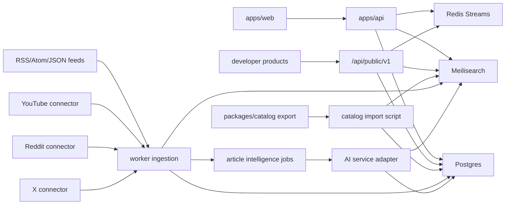
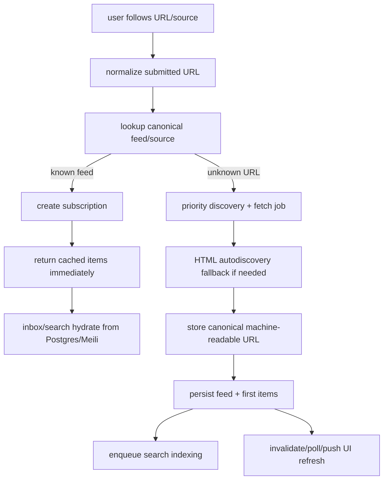
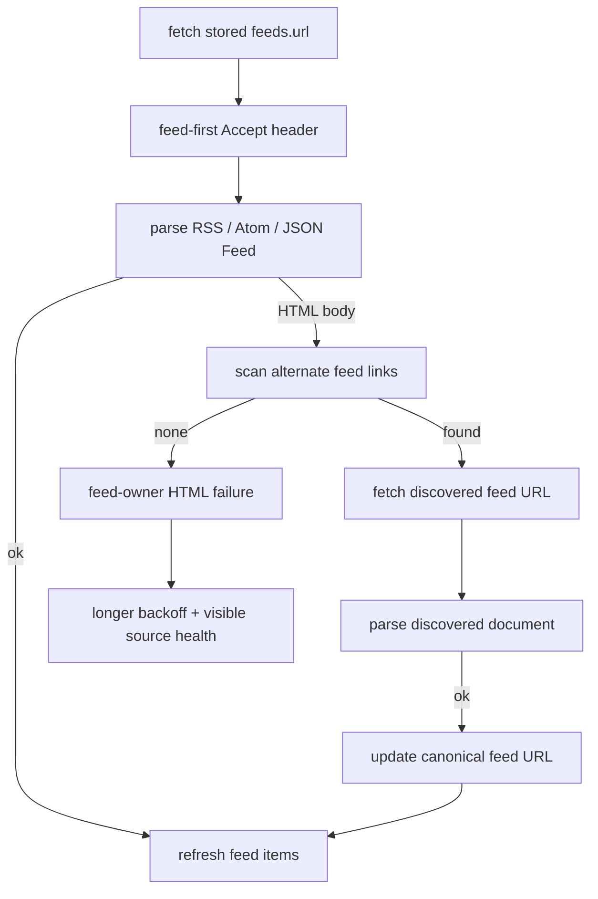
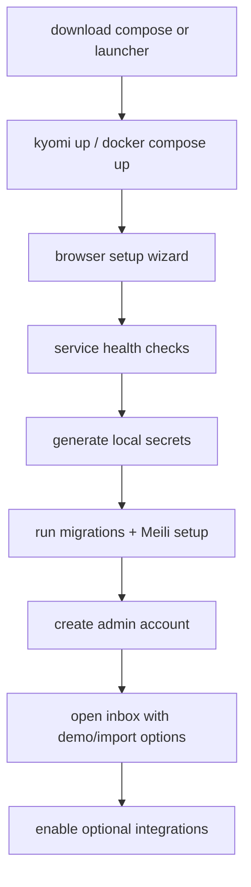
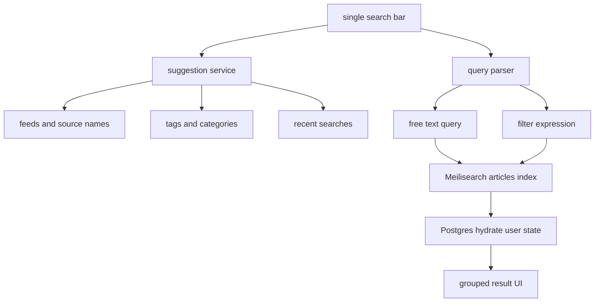
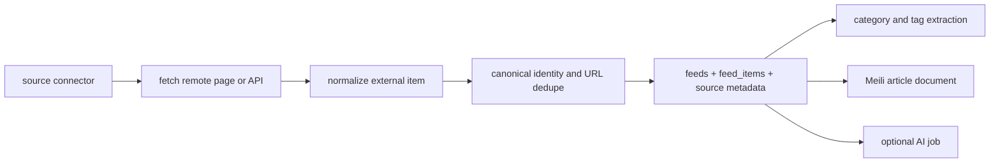
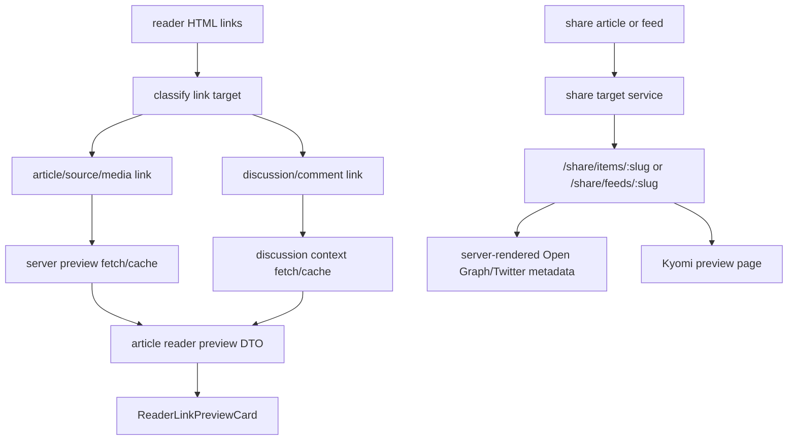
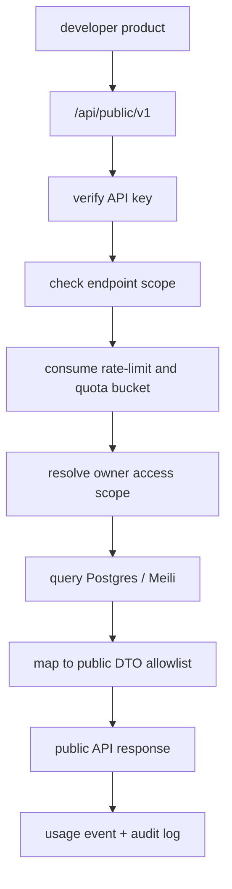
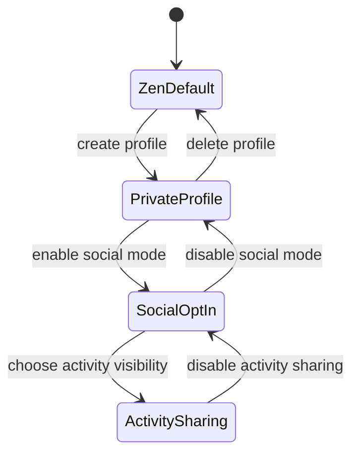

# Kyomi Platform Expansion Roadmap Implementation Plan

> **For agentic workers:** REQUIRED SUB-SKILL: Use superpowers:subagent-driven-development for implementation work with independent lanes, or use superpowers:executing-plans task-by-task if working serially. Steps use checkbox (`- [ ]`) syntax for tracking. Do not edit this plan while executing it; advance checkbox status only.

**Goal:** Expand Kyomi from an RSS-first reader into a source-aware, searchable, AI-assisted reading platform with a carefully scoped developer API, a trustworthy self-hosting path, and million-feed scale readiness, while preserving the calm default reading experience.

**Architecture:** Add a metadata spine across Postgres, Meilisearch, and article DTOs; reuse Better Auth for OAuth and verified API-key primitives; add source connectors behind explicit credentials and feature flags; route article intelligence through a small AI service boundary; make social features opt-in and private by default; expose only allowlisted public API DTOs through a separate `/api/public/v1` contract; split background refresh scale from the user-initiated feed-follow fast path; treat Postgres as the durable source of truth for ingestion, backfills, upgrades, and recovery; make self-hosted/local Kyomi a first-class deployment mode with zero-credential defaults.

**Tech Stack:** Bun, TypeScript, Elysia, Drizzle/Postgres, Redis Streams, Meilisearch, Better Auth, OpenAPI, TanStack React Start/Router/Query/Form, Tailwind CSS, `@kyomi/ui`, Python catalog pipeline, YouTube Data API v3, Reddit API, X API v2, and a verified AI provider adapter.

**Review Status:** Drafted with `writing-plans` and refined with the `plan-tune`, CEO review, engineering review, and developer-experience review rubrics. Engineering review D1 selected the parent-roadmap structure: this file owns sequence, dependencies, and acceptance gates; child implementation plans own code-level task detail. Engineering review also added explicit gates for source identity, search authorization, token-vault boundaries, AI annotation privacy, share/discussion previews, public developer API exposure, feed-follow performance, durability/recovery, and self-hosting.

**Plan Type:** Parent roadmap. Do not implement code directly from this file except for creating or updating the child implementation plans named below.

---

## Product Principles

- Reading remains zen by default. Social surfaces, public profiles, AI summaries, and recommendation features are opt-in.
- Existing RSS behavior must not regress while new source types are added.
- Scale readiness comes before source expansion. Large catalog imports, connector backfills, and AI indexing must wait for the feed refresh pipeline to handle more feeds safely.
- Search should feel like one search bar, not a collection of separate tools. Free text, category filters, source filters, and suggestions all route through one search service.
- Metadata should be durable and inspectable. Categories, tags, source type, language, AI annotations, and connector provenance should be stored with source/confidence fields.
- External platform support must respect credentials, quota, rate limits, API terms, and user privacy. Prefer official APIs and first-party export surfaces; use RSS endpoints where they are stable and allowed.
- Normal app runtime and onboarding must not require the optional Python catalog pipeline.
- Sharing should use Kyomi-owned share targets when possible so feed items and feeds get reliable previews, while the original publisher URL remains visible and reachable.
- Developer API access is a product surface, not a shortcut into internal routes. Public API responses must use explicit DTO allowlists, scoped credentials, rate limits, audit logs, and documentation that can be trusted by third-party builders.
- Self-hosted/local Kyomi should feel like an appliance, not a source checkout. Core reading, RSS, search, saved/read state, and OPML should work with no third-party credentials.
- User-initiated feed follows are a separate fast path from scheduled refresh. Known feeds should populate from cached normalized items immediately; unknown feeds should acknowledge the follow quickly and stream/poll first items as soon as the high-priority fetch completes.
- Kyomi accepts human-facing source URLs, but workers refresh canonical machine-readable source URLs. HTML returned during refresh triggers autodiscovery or a feed-owner failure classification; it is not treated as a new feed format unless Microformats support is explicitly planned.

## Current Architecture From Audit

What already exists:

- `apps/api/src/adapters/search/meili.ts` provides a Meilisearch-backed feed discovery index.
- `docker/docker-compose.yml` already includes Meilisearch, Redis, Postgres, and Garage S3.
- `packages/catalog` exports feed metadata with `language` and `category`, but `apps/api/src/scripts/import-catalog-feeds.ts` currently imports only `feed_url`, `title`, `description`, and `link`.
- `packages/catalog/TODO.md` already captures the remaining catalog work: canonical merge, metadata completion, Vols.RSS fields, favicon S3 serving, enrichment, OPML progress, search quality, production readiness, and rollback.
- `packages/db/src/schema/auth.ts`, `packages/db/src/better-auth.ts`, and `apps/api/src/adapters/auth/index.ts` already support Better Auth email/password sessions.
- Google OAuth is not configured in `apps/api/src/adapters/auth/index.ts`, and `apps/api/.env.example` does not expose Google provider variables.
- `apps/web/src/modules/settings/` has real account and appearance panels, but personalization and advanced panels are empty, billing is stub UI, and feedback submission is local only.
- `packages/db/src/schema/articles.ts` already has `articleViewEvents`, `articleClips`, `feedItemUserState`, and `feedUserStats`, which can support private history, recaps, and future social activity.
- Feed item cards already have an unused lower-left footer slot when an item is not saved. That is the correct place to render category/tag chips.
- `packages/reader/src/web/components/link-preview-card.tsx` currently wraps article links client-side and shows only a source label plus URL. It does not receive server-enriched preview content.
- `apps/api/src/modules/articles/reader/normalize-content.ts` already treats stored content that is only `Comments` or `Comments on ...` as a signal to extract the actual article body instead of trusting the placeholder text.
- Reader and feed item share actions currently call `navigator.share` or copy `item.link`, so Kyomi does not control the Open Graph/Twitter preview shown by chat apps, social apps, or search crawlers.
- `apps/api/src/adapters/rate-limit/plugin.ts` already provides Redis-backed route rate limiting with an in-memory fallback, but it does not yet model developer principals, scopes, quotas, usage dashboards, or public API audit logs.
- `apps/api/src/app/http/api-v1-router.ts` owns the authenticated product API under `/api/v1`, and `apps/api/src/adapters/openapi/plugin.ts` documents that product API under `/api/v1/openapi`. There is no separate external developer contract.
- `docs/superpowers/plans/2026-07-01-feed-refresh-scale-architecture.md` already covers scaling feed refresh from the current local worker shape to horizontally scaled workers and large feed catalogs.
- `packages/worker/src/services/feed/parse.ts` already rejects HTML bodies with `Unsupported feed format: received HTML document`; scheduled refresh currently does not run the same HTML autodiscovery fallback used by initial discovery.
- The Docker compose stack can run local infrastructure, but there is no one-command local appliance flow, browser installer, doctor command, backup/restore workflow, or published image naming/release policy.

Primary gaps:

- Search is limited to feed discovery. It does not index article content, category, tags, source type, language, author, or user state.
- There is no normalized source model for RSS, YouTube, Reddit, X, catalog imports, or future connectors.
- Tags/categories are not part of API DTOs, Meili documents, or feed item card props.
- AI functionality has no verified dependency boundary. The requested TanStack AI SDK must be confirmed before installation; if no stable official SDK is available, Kyomi needs a local adapter that can be backed by an approved provider.
- Social mode has promising data primitives but no privacy model, profile schema, relationship model, or UI boundary.
- Comment/discussion links inside feed items are not modeled as related content. A link whose visible text is `Comments` can only show a bare URL preview today.
- Feed item and feed sharing lacks server-owned public preview routes, crawler metadata, revocation/visibility rules, and tests that prove private user state is not exposed.
- A public-facing developer API does not exist. Adding one safely requires a separate router, credential model, scope taxonomy, rate-limit/quota model, OpenAPI contract, developer docs, and tests that prove internal fields and private user state are never exposed.
- The roadmap protects high-volume scheduled refresh, but it does not yet define an interactive feed-follow SLO, priority lane, known-feed cache path, or cold unknown-feed user experience.
- Redis Streams are treated as job transport, but the roadmap needs a durable Postgres ingestion ledger for refresh attempts, backfills, indexing, replay, failed jobs, and upgrade audits.
- Upgrade safety is under-specified for rolling workers, versioned queue payloads, Meili index swaps, backfills that span deploys, and old/new code running together.
- Self-hosting is not yet a product lane. Without prebuilt images, a guided setup, health checks, backups, and upgrade docs, local users inherit open-source setup friction.
- Stored feed URLs may be human-facing pages, stale endpoints, access-denied pages, or content-negotiated HTML. The refresh path needs feed-first `Accept` headers, HTML autodiscovery, canonical URL updates, and feed-owner failure classification.

## Scale Readiness Dependency

This roadmap should not enable large catalog growth, connector backfills, or high-volume scheduled refreshes until the Feed Refresh Scale Architecture plan has landed.

Minimum scale gate:

- Scale-critical Postgres indexes exist for scheduler selection, subscription fanout, inbox reads, and saved/read state.
- Redis Streams are routed by workload, bounded, and configured with explicit worker concurrency.
- Scheduled feed claiming is atomic and uses row locks with `SKIP LOCKED`.
- Scheduler and worker process roles are split so more workers do not create more schedulers.
- Refresh amplification is bounded by cached search setup, host politeness, and controlled enrichment behavior.
- Queue lag, scheduler claims, feed-owner errors, platform errors, and host-level failure classes are observable.
- Production rollout docs include scale math for 500K and 1M feeds, concurrent index guidance, and rollback.

Million-feed product gate:

- Scale targets are explicit before implementation: at least 1M feeds, stretch target above 5M feeds, expected items/day, active users, search document count, AI jobs/day, and connector refresh volume.
- Feed refresh cadence is adaptive, not uniformly hourly. The scheduler uses subscriber count, source activity, HTTP cache headers, observed publish frequency, failure class, platform quota, and host politeness to choose refresh windows.
- User-triggered feed follows, OPML imports, scheduled refresh, connector backfills, search indexing, AI enrichment, preview fetching, and catalog imports use separate priority lanes or route-family limits.
- Known-feed follows populate from existing normalized items without a network fetch. Unknown-feed follows acknowledge quickly, enqueue a high-priority discovery/fetch job, and expose visible progress to the UI.
- Cold-follow SLOs distinguish what can actually be instant from what requires network I/O:
  - API follow acknowledgement: target `<100ms` p95 after auth and validation.
  - Known-feed first visible items: target `<300ms` p95 from cached Postgres/Meili data.
  - Unknown-feed first visible items: target `<2s` p50 and `<5s` p95 when the publisher responds normally.
  - Full historical backfill, search indexing, AI enrichment, previews, and favicon work are background operations with visible status.
- Sub-millisecond populated articles for a brand-new unknown feed is not a realistic networked SLO. The product target is "feels instant": immediate subscription state, cached data when available, and progressive hydration for first fetches.
- Postgres is the durable ingestion and backfill ledger. Redis Streams transport work, but important ingestion intent, attempts, outcomes, replay cursors, and backfill progress must be reconstructable from Postgres.
- Meilisearch is rebuildable from Postgres through versioned indexes and atomic swaps. A broken index must not require data loss or ad hoc mutation to recover.
- Rolling deploys tolerate old and new workers concurrently. Queue payloads, ingestion ledger records, connector payloads, and backfill cursors must be versioned before incompatible worker changes ship.

Scale rollout order:

1. Land the feed refresh scale plan.
2. Import and dedupe catalog metadata in dry-run mode.
3. Backfill source/category/tag metadata in bounded batches.
4. Create or update Meilisearch indexes.
5. Enable article search on existing articles.
6. Enable connector ingestion at low concurrency.
7. Enable the feed-follow fast path only after known-feed and unknown-feed SLO tests pass with realistic network fixtures.
8. Enable public API in a closed beta only after route-level quotas, usage metrics, and private-state leak tests pass.
9. Increase connector, scheduler, cold-follow, indexing, and public API throughput only after queue lag, oldest job age, database utilization, Meili indexing latency, cold-follow p95, public API 429/5xx rates, and host error rates are measured.

## Target Architecture



The most important invariant: every user-facing article, regardless of source, belongs to a `feeds` row and becomes a normalized feed item with source metadata, category/tag assignments, search documents, and privacy-aware user state.

The public API invariant: external callers never receive internal entities directly. Every endpoint must map through a public DTO allowlist after credential, scope, object-level authorization, property-level authorization, and rate-limit checks.

The scale invariant: scheduled refresh throughput and interactive feed-follow latency are separate codepaths with separate SLOs, priority, observability, and failure handling. Optimizing one must not starve or hide failures in the other.

The durability invariant: Postgres records the durable truth for subscriptions, source identity, feed URLs, feed items, ingestion attempts, backfill progress, share targets, public API audit events, and user state. Redis queues, Meilisearch indexes, object storage derivatives, and AI/indexing outputs must be replayable or rebuildable from durable state.

The self-hosting invariant: a local user can run core Kyomi without Google, YouTube, Reddit, X, AI, or public API credentials. Optional integrations advertise disabled status with clear enablement steps instead of failing at startup.

## Feed Follow Cold Start Flow



Cold-start requirements:

- Store the original submitted URL separately from the canonical feed URL and site URL.
- Normalize known feeds by canonical feed URL, canonical site URL, platform source id, and final redirect target where safe.
- Return an optimistic subscribed state before first unknown-feed fetch completes.
- If the feed is already known, do not refetch before showing existing items.
- If the feed is unknown, put discovery/fetch ahead of scheduled refresh and OPML import, but still enforce host politeness and global backpressure.
- First fetch should parse the latest visible feed items first; historical expansion, metadata enrichment, favicon, preview, AI, and indexing jobs follow.
- UI should show explicit states: `subscribed`, `fetching_latest`, `items_ready`, `feed_unavailable`, and `needs_feed_url`.
- Performance tests must cover known feed, unknown RSS, homepage with alternate RSS link, stale endpoint returning HTML, slow publisher, duplicate concurrent follows, and two users following the same unknown URL at once.

## Feed URL Canonicalization Flow



Canonicalization requirements:

- Worker refresh `Accept` headers should prefer `application/feed+json`, `application/rss+xml`, `application/atom+xml`, XML, and JSON feed types before `text/html`.
- HTML returned during scheduled refresh is not a new parser format by default. It triggers autodiscovery for `<link rel="alternate">` feed URLs.
- If autodiscovery succeeds, update the canonical machine-readable `feeds.url` while retaining the submitted/site URL for display and audit.
- If autodiscovery fails, classify as feed-owner failure such as `html_not_feed`, `access_denied_html`, `captcha_html`, `login_html`, or `stale_endpoint_html`; do not log it as unknown platform failure.
- Microformats `h-feed` / `h-entry` support is explicitly out of scope unless a separate plan adds HTML-as-feed semantics and tests.

## Self-Hosting And Local Appliance Flow



Self-hosting requirements:

- Publish prebuilt images with canonical GHCR names: `ghcr.io/kyomi/web`, `ghcr.io/kyomi/api`, `ghcr.io/kyomi/worker`, `ghcr.io/kyomi/catalog`, and `ghcr.io/kyomi/local` for a future all-in-one appliance image.
- Docker Hub mirrors may use `kyomi/web`, `kyomi/api`, `kyomi/worker`, `kyomi/catalog`, and `kyomi/local`, but GHCR remains the canonical provenance source.
- Provide Docker Compose profiles for `core`, `ai`, `connectors`, `catalog`, and `devtools`.
- Provide `kyomi up`, `kyomi doctor`, `kyomi backup`, `kyomi restore`, and `kyomi reset` as wrapper commands or equivalent container commands.
- The browser installer handles admin account creation, generated local secrets, base URL, service health, migrations, Meili index setup, optional OPML import, and optional integration credentials.
- Backup/restore covers Postgres and uploaded/object-storage assets. Meilisearch can be restored from snapshot or rebuilt from Postgres, but the chosen strategy must be documented and tested.
- Local AI can use Ollama or an OpenAI-compatible endpoint, but AI remains optional and disabled by default.
- Self-hosting smoke tests must prove a fresh environment reaches a usable inbox in under 5 minutes on a normal developer machine, excluding first image download.

## Source Search Flow



Query grammar for the first implementation:

- `engineering rss` searches article title, summary, content excerpt, feed title, and source labels.
- `tag:ai` filters normalized tag slugs.
- `category:engineering` filters normalized category slugs.
- `source:youtube`, `source:reddit`, `source:x`, and `source:rss` filter source kind.
- `from:discord` filters feed/source display labels and domains.
- `lang:en` filters content language.
- `is:saved` and `is:unread` are user-state filters applied after authorization.

## Connector Flow



Connectors produce the same normalized contract:

```ts
export type SourceKind = "rss" | "youtube" | "reddit" | "x";

export type MetadataProvenance = "feed" | "catalog" | "connector" | "ai" | "user";

export type MetadataHint = {
  label: string;
  provenance: MetadataProvenance;
  confidence: number | null;
};

export type NormalizedSourceItem = {
  sourceKind: SourceKind;
  sourceId: string;
  externalId: string;
  canonicalUrl: string;
  title: string;
  summary: string | null;
  contentHtml: string | null;
  contentText: string | null;
  authorName: string | null;
  publishedAt: Date | null;
  language: string | null;
  categoryHints: MetadataHint[];
  tagHints: MetadataHint[];
  media: Array<{ kind: "image" | "video" | "thumbnail"; url: string }>;
};
```

## Sharing And Discussion Preview Flow



Preview contracts:

```ts
export type LinkPreviewRelation = "article" | "discussion" | "source" | "media" | "unknown";

export type LinkPreviewTarget = {
  url: string;
  normalizedUrl: string;
  relation: LinkPreviewRelation;
  sourceKind: SourceKind | null;
  title: string | null;
  excerpt: string | null;
  imageUrl: string | null;
  commentCount: number | null;
  topPublicCommentExcerpts: string[];
  fetchedAt: Date | null;
  status: "pending" | "ready" | "failed" | "unsupported";
};

export type ShareTargetKind = "feed_item" | "feed";

export type ShareTarget = {
  slug: string;
  kind: ShareTargetKind;
  entityId: string;
  visibility: "public" | "unlisted" | "disabled";
  createdByUserId: string | null;
  revokedAt: Date | null;
};
```

Discussion preview invariants:

- A `Comments` anchor is related context, not the article body. It may enrich the link preview card or add a secondary discussion affordance, but it must not replace the reader's selected article content.
- For Reddit and other supported discussion platforms, show actual public discussion context only through official/publicly allowed surfaces and only as capped excerpts, counts, and source links.
- For generic comment pages, v1 stores title, excerpt, image, and URL metadata. It does not scrape or archive arbitrary comment trees.
- Link preview enrichment runs on the server through the existing safe outbound fetch policy. The browser reader must not fetch arbitrary third-party preview URLs.
- `ReaderLinkPreviewCard` receives preview DTOs from the article detail payload and uses explicit `data-reader-*` markers for relation/status rather than broad DOM selectors.

Share preview invariants:

- Sharing a public feed item or public feed should produce a Kyomi URL that renders crawler-friendly `og:title`, `og:description`, `og:image`, canonical URL, and Twitter card tags.
- The shared preview page must show the publisher/source and link out to the original URL. Kyomi should not obscure source ownership.
- Zen mode and social mode both use share targets. Social mode may add profile context only when the user's social visibility rules allow it.
- Shared feed item and feed pages must not expose read state, saved state, folders, private notes, private AI annotations, private knowledge banks, or non-public activity.
- Private clips and future private/user-scoped source items are not publicly shareable in this roadmap unless a separate private-share access-token design is reviewed.

## Public Developer API Flow



Public API principles:

- `/api/public/v1` is separate from the product session API under `/api/v1`.
- Public API keys are owner-authorized credentials for developer integrations. They are not a substitute for user-scoped Reddit/X tokens or other external platform credentials.
- Keys are shown once, stored only as hashes or through a verified Better Auth API-key storage path, and identified in logs by key id/prefix only.
- API keys must be scoped. The initial scope set is `feeds:read`, `items:read`, `search:read`, `tags:read`, `shares:write`, and `usage:read`.
- Public API v1 is read-mostly. Write access is limited to creating and revoking Kyomi share targets for objects the API principal can already access.
- Query-string API keys are not allowed. Use `Authorization: Bearer <key>` or a single documented header that does not conflict with browser session auth.
- Every response uses cursor pagination, maximum page sizes, response-size caps, and stable error envelopes.
- Every endpoint is covered by object-level authorization tests and property-level privacy tests before the public API feature flag can be enabled.

Public API v1 exposure policy:

| Resource | Public API v1 exposure | Notes |
| --- | --- | --- |
| Feeds | Read feed metadata for feeds owned or followed by the API principal | No folder membership or private subscription notes. |
| Feed items | Read normalized public article/source metadata for accessible feeds | No read state, saved state, hidden state, clips, private notes, or private annotations. |
| Search | Search accessible feed items through the existing search service | Must reuse search access-scope logic and avoid leaking global hit counts. |
| Tags and categories | Read normalized public tag/category dictionaries and assignments on accessible items | Include provenance only when safe and useful. |
| Share targets | Create/revoke share targets for public feed items and feeds | Must reuse Task 13 visibility checks. |
| Usage | Read the API principal's own key metadata and usage summary | No cross-user usage or raw request logs. |
| Social profiles | Not exposed in v1 unless Task 12 explicitly marks fields public | No read activity through public API in this roadmap. |
| Knowledge banks | Not exposed in v1 | Private by default; needs a separate sharing and consent design. |
| Source connector management | Not exposed in v1 | Avoid external mutation of connector credentials, follows, or refresh schedules. |

## Privacy Model



Privacy invariants:

- New users start in `ZenDefault`.
- Profiles are private until the user explicitly creates one.
- Read activity is private until the user explicitly enables sharing.
- Sharing is evaluated per event at read time and at display time.
- AI knowledge banks are private by default and never become social content without a separate user action.
- Shared AI annotations are allowed only for public feed items. User-owned clips, private future sources, and any content fetched through user-scoped credentials require user-scoped annotations.
- Share targets never imply activity sharing. A user can share an article or feed while keeping their profile, reading history, saves, and knowledge banks private.

## External Source Notes

- Better Auth Google provider setup requires Google OAuth credentials, provider config, and a callback URL such as `/api/auth/callback/google`: [Better Auth Google docs](https://better-auth.com/docs/authentication/google).
- YouTube source support should use official YouTube Data API resources for videos, playlist items, and captions: [videos.list](https://developers.google.com/youtube/v3/docs/videos/list), [playlistItems.list](https://developers.google.com/youtube/v3/docs/playlistItems/list), [captions.list](https://developers.google.com/youtube/v3/docs/captions/list), and [captions.download](https://developers.google.com/youtube/v3/docs/captions/download).
- Reddit support must begin from official API and OAuth scope behavior: [Reddit API docs](https://www.reddit.com/dev/api/).
- X support must assume API v2 access requirements and timeline limits: [X API user timelines](https://docs.x.com/x-api/posts/timelines/introduction).
- Meilisearch categorical search depends on configured filterable attributes and ranking rules: [filtering](https://www.meilisearch.com/docs/learn/filtering_and_sorting/filter_search_results) and [ranking rules](https://www.meilisearch.com/docs/learn/relevancy/ranking_rules).
- Public developer API design should follow the current OWASP API Security risk model, especially object-level authorization, property-level authorization, resource consumption, API inventory, SSRF, and unsafe third-party API consumption: [OWASP API Security Top 10 2023](https://owasp.org/API-Security/editions/2023/en/0x11-t10/).
- Public API documentation should use a separate OpenAPI contract with explicit security schemes for API keys or bearer credentials: [OpenAPI Specification](https://spec.openapis.org/oas/latest.html).
- Better Auth's API Key plugin can create, manage, verify, permission-check, and rate-limit API keys, but Task 1 must verify package compatibility and schema fit before adopting it: [Better Auth API Key plugin](https://better-auth.com/docs/plugins/api-key).
- The requested TanStack AI SDK requires verification before installation. If no official stable SDK can be confirmed, implement Kyomi's AI service against a local provider adapter and record the decision in the dependency audit.

## Global Constraints

- Do not edit this plan while executing it; advance checkbox status only.
- Keep `apps/api/src/modules/feeds/routes.ts` thin. New search, connector, and AI work belongs in dedicated modules or shared packages.
- Avoid feeds, inbox, and sidebar import cycles by importing concrete module paths, not broad barrels.
- Keep normal runtime and setup independent from Poetry, `uv`, and catalog sync.
- Keep self-hosted/local core setup independent from external API credentials, paid AI services, Google OAuth, YouTube, Reddit, X, and public API enablement.
- Use explicit Drizzle migrations and update `packages/db/drizzle/meta/_journal.json`.
- Do not enable large connector backfills or catalog imports until the Scale Readiness Dependency gate is complete.
- Do not enable million-feed scheduled refresh throughput until feed-follow SLO tests, ingestion ledger replay tests, and adaptive refresh controls are in place.
- Reuse existing Meilisearch infrastructure. Do not add a second search engine before proving Meili cannot handle the required ranking, filtering, or indexing behavior.
- Treat Meilisearch indexes as rebuildable derivatives. Every index backfill or rebuild must have versioned index names, progress state, swap criteria, and rollback.
- Use Better Auth for Google OAuth rather than a separate auth library.
- Use Tailwind utilities and `@kyomi/ui` primitives for frontend settings, onboarding, and search UI.
- Use `LazyMotion` plus `m` from `motion/react` for Framer Motion work.
- Use `bunx`, not `npx`, for one-off CLI tooling.
- Do not add social sharing defaults that expose reading history.
- Do not trust LLM output. Validate structured outputs, store provenance, and display confidence only when it is meaningful.
- Do not require API credentials for YouTube, Reddit, X, Google OAuth, or AI providers in local development unless the related feature flag is enabled.
- Reddit and X v1 connectors are public-source or app-credential only. Per-user Reddit/X OAuth, home timelines, private follows, or refresh-token storage require a separate token-vault child plan with encryption, key rotation, revocation, and audit tests.
- Store submitted URL, canonical feed URL, site URL, and discovery provenance separately. User-facing URLs can be human pages; worker refresh URLs should be machine-readable feed endpoints.
- Scheduled refresh should never treat HTML as a successful feed parse. HTML is either autodiscovery input or a classified feed-owner failure.
- Queue payloads that can survive deploys must be versioned before rolling workers or replaying old jobs.
- Backfills must be resumable, pausable, bounded, and auditable through Postgres progress state rather than one-off scripts.
- Local/self-hosting image names must stay consistent with the monorepo surfaces: `web`, `api`, `worker`, `catalog`, and `local`.
- Link previews and discussion previews must be server-enriched, cached, size-limited, and governed by the existing outbound URL safety policy.
- Server-owned share URLs must re-check visibility on every request and must never include private user state in HTML, Open Graph metadata, or JSON hydration payloads.
- Public developer API endpoints must live under `/api/public/v1` and must not reuse private `/api/v1` response objects directly.
- Public developer API documentation must be generated from a public OpenAPI contract that excludes internal product-session routes, auth callbacks, queue/admin routes, and experimental feature flags.
- Public API credentials must be hashed or delegated to a verified Better Auth API-key storage path. Plaintext API keys must never be stored, logged, returned after creation, or accepted in query strings.
- Public API rate limiting must apply at multiple layers: key id, owner user id, route family, IP fallback for unauthenticated failures, and global emergency limit.
- Public API endpoints must use DTO allowlists. Adding a new field requires an explicit privacy review and test that proves read state, saved state, folders, clips, private notes, private AI annotations, knowledge banks, social activity, and source credentials are absent unless separately approved.

## NOT in Scope

- Paid billing implementation. The settings billing panel can show plan status and disabled upgrade affordances until a payment provider is selected.
- Native mobile apps.
- Posting, commenting, voting, or replying on Reddit or X.
- Full comment-tree ingestion, comment posting, voting, moderation actions, or private discussion access.
- Per-user Reddit/X OAuth, home timelines, private follows, or platform refresh-token storage before a reviewed token-vault plan exists.
- Downloading or storing YouTube video files.
- Public algorithmic social feeds enabled by default.
- Training custom models on user reading history.
- Replacing the existing feed refresh architecture.
- Guaranteeing that brand-new unknown feeds populate articles in sub-millisecond time. The roadmap targets instant acknowledgement and cached known-feed population, while network fetches remain bounded by publisher latency.
- Microformats `h-feed` / `h-entry` parsing or arbitrary HTML-as-feed ingestion. HTML autodiscovery is in scope; treating generic pages as feeds needs a separate reviewed plan.
- Making the all-in-one `ghcr.io/kyomi/local` image the first self-hosting deliverable. It is a future appliance target after split images and compose are stable.
- Delegated third-party OAuth consent for developers to access other users' Kyomi accounts. Public API v1 uses owner-authorized API keys; OAuth app consent needs a separate reviewed child plan.
- Public API write access for following/unfollowing sources, mutating connector credentials, marking read/saved state, managing folders, editing clips/notes, creating knowledge banks, or changing social visibility.
- Exposing private read activity, saved state, folder names, private clips, private notes, private AI annotations, knowledge banks, source credentials, raw request logs, or internal queue/admin diagnostics through the public API.

## Feature Coverage Map

| User note | Covered by |
| --- | --- |
| Add YouTube support | Task 8 |
| Expand system scale and take in more feeds | Scale Readiness Dependency plus Tasks 2, 3, 5, 8, 9, 13, 15, and 16 |
| Reach well over 1M feeds | Feed Refresh Scale Architecture plus Tasks 15, 16, and 18 |
| Make first feed follow feel instant | Task 15 |
| Add durability, replay, and upgrade safety | Task 16 |
| Run Kyomi locally with extreme ease | Task 17 |
| Self-host with prebuilt Docker images and guided setup | Task 17 |
| Handle stored feed URLs that return HTML pages | Tasks 2 and 15 |
| i18n and translations | Task 11 |
| Tagging feed items based on category | Tasks 2, 3, and 4 |
| Search service for the search bar | Task 5 |
| Continue `packages/catalog/TODO.md` work | Task 3 |
| Add TanStack AI SDK for articles and knowledge banks | Tasks 1 and 10 |
| Implement rest of settings | Task 6 |
| User onboarding | Task 7 |
| Google OAuth with Better Auth | Task 7 |
| Social mode with zen default | Task 12 |
| Show actual content for `Comments` links in feed items/previews | Task 13 |
| Share feed items and feeds with Reddit-like preview pages | Task 13 |
| Public-facing API for developers with rate limits and safe exposure rules | Task 14 |
| Support Reddit and X | Task 9 |

## Roadmap Execution Model

This file is the parent roadmap. It intentionally covers more than one independently shippable subsystem, so implementation must be split into child plans before code changes begin.

Rules for child plans:

- A child plan must live in `docs/superpowers/plans/`.
- A child plan must use the standard implementation-plan format with exact files, interfaces, red/green tests, validation commands, failure modes, rollback notes, and commit checkpoints.
- A child plan must pass `/plan-eng-review` or an equivalent engineering review before implementation starts.
- A child plan must preserve the parent roadmap's global constraints, privacy model, scale gate, and feature-flag defaults.
- A child plan may narrow scope for a tranche, but it must record which parent-roadmap requirements it defers and why.
- Code work must update the relevant child plan checkboxes, not this parent roadmap, except when the parent dependency graph itself changes.

Child plan gate matrix:

| Child plan | Parent tasks covered | Required before | Scope |
| --- | --- | --- | --- |
| `2026-07-01-feed-refresh-scale-architecture.md` | Scale Readiness Dependency | Any high-volume catalog import, connector backfill, or scheduled refresh expansion | Scheduler, worker roles, queue partitioning, scale indexes, host politeness, queue observability |
| `2026-07-01-platform-foundation-metadata-search.md` | Tasks 1, 2, 3, 4, 5 | Tags, search, catalog metadata, or source schema implementation | Dependency audit, source/category/tag schema, catalog import preservation, feed item chips, article/feed search with explicit access filtering |
| `2026-07-01-settings-onboarding-auth.md` | Tasks 6, 7 | Settings, onboarding, or Google OAuth implementation | Preferences, feedback, settings panels, onboarding state, Better Auth Google provider |
| `2026-07-01-source-connectors.md` | Tasks 8, 9 | YouTube, Reddit, or X source implementation | Connector interface, source identity, public/app-credential platform access, quota/backoff, mocked official API fixtures |
| `2026-07-01-article-intelligence-knowledge-i18n.md` | Tasks 10, 11 | AI, knowledge bank, translation, or app locale implementation | AI provider adapter, validated outputs, knowledge banks, translation cache, app i18n |
| `2026-07-01-social-mode.md` | Task 12 | Any profile, follow, or read-activity sharing implementation | Profiles, follows, visibility rules, blocks, social UI, privacy tests |
| `2026-07-01-sharing-discussion-previews.md` | Task 13 | Any Kyomi-owned share URL, feed share preview, feed item share preview, or enriched comments/discussion link preview | Preview classification, server-side preview cache, public discussion excerpts, share target routes, Open Graph metadata, privacy tests |
| `2026-07-01-public-api-platform.md` | Task 14 | Any public developer API endpoint, API key management surface, public API docs, or external client contract | Separate `/api/public/v1` router, scoped API keys, public DTO allowlists, rate limits, usage/audit logs, OpenAPI docs, privacy tests |
| `2026-07-01-feed-follow-cold-start-performance.md` | Task 15 | Any new follow-source path, million-feed performance gate, or feed URL canonicalization change | Known-feed cache path, unknown-feed priority fetch, SLOs, HTML autodiscovery, canonical URL updates, priority queues, load tests |
| `2026-07-01-durability-upgrades-recovery.md` | Task 16 | Any durable ingestion ledger, queue payload versioning, backfill/reindex framework, backup/restore, or rolling worker upgrade | Postgres ingestion ledger, replay, DLQs, versioned payloads, Meili index swaps, migration safety, restore drills |
| `2026-07-01-self-hosting-local-appliance.md` | Task 17 | Any self-hosting docs, local launcher, published images, setup wizard, local doctor, backup, restore, or upgrade UX | GHCR image naming, compose profiles, browser installer, zero-credential defaults, health checks, backup/restore, upgrade docs |
| `2026-07-01-platform-rollout-observability.md` | Task 18 | Production rollout of the platform expansion | Smoke tests, feature flag rollout, backfills, dashboards, rollback, release notes |

Child plan creation order:

1. Finish or re-review `2026-07-01-feed-refresh-scale-architecture.md`.
2. Create and review `platform-foundation-metadata-search`.
3. Create and review `settings-onboarding-auth`.
4. Create and review `source-connectors`.
5. Create and review `article-intelligence-knowledge-i18n`.
6. Create and review `social-mode`.
7. Create and review `sharing-discussion-previews`.
8. Create and review `public-api-platform`.
9. Create and review `feed-follow-cold-start-performance`.
10. Create and review `durability-upgrades-recovery`.
11. Create and review `self-hosting-local-appliance`.
12. Create and review `platform-rollout-observability`.

## Parent Gate List

- [ ] Task 0: Create and review child implementation plans before coding each lane.
- [ ] Task 1: Create the dependency, platform, and rollout audit.
- [ ] Task 2: Add normalized source, category, tag, and catalog metadata schema.
- [ ] Task 3: Continue catalog backlog and preserve catalog metadata through import.
- [ ] Task 4: Render category/tag chips in feed item cards.
- [ ] Task 5: Build the search service on existing Meilisearch infrastructure.
- [ ] Task 6: Complete settings panels and persistence.
- [ ] Task 7: Add onboarding and Google OAuth.
- [ ] Task 8: Add source connector framework and YouTube support.
- [ ] Task 9: Add Reddit and X connector support behind access gates.
- [ ] Task 10: Add article intelligence and knowledge banks.
- [ ] Task 11: Add app i18n and article translation support.
- [ ] Task 12: Add opt-in social mode.
- [ ] Task 13: Add sharing and discussion previews.
- [ ] Task 14: Add public developer API platform.
- [ ] Task 15: Add feed-follow cold start and million-feed performance gates.
- [ ] Task 16: Add durability, recovery, and upgrade safety.
- [ ] Task 17: Add self-hosting and local appliance support.
- [ ] Task 18: Run final validation, observability, and rollout checks.

## Task 0: Child Implementation Plan Gates

**Why:** This roadmap is intentionally larger than one shippable PR. Child plans turn each lane into a bounded, testable implementation unit while keeping the parent roadmap as the dependency graph.

### Files

- Create `docs/superpowers/plans/2026-07-01-platform-foundation-metadata-search.md`
- Create `docs/superpowers/plans/2026-07-01-settings-onboarding-auth.md`
- Create `docs/superpowers/plans/2026-07-01-source-connectors.md`
- Create `docs/superpowers/plans/2026-07-01-article-intelligence-knowledge-i18n.md`
- Create `docs/superpowers/plans/2026-07-01-social-mode.md`
- Create `docs/superpowers/plans/2026-07-01-sharing-discussion-previews.md`
- Create `docs/superpowers/plans/2026-07-01-public-api-platform.md`
- Create `docs/superpowers/plans/2026-07-01-feed-follow-cold-start-performance.md`
- Create `docs/superpowers/plans/2026-07-01-durability-upgrades-recovery.md`
- Create `docs/superpowers/plans/2026-07-01-self-hosting-local-appliance.md`
- Create `docs/superpowers/plans/2026-07-01-platform-rollout-observability.md`

### Steps

- [ ] Create the foundation child plan covering Tasks 1 through 5, with the existing feed-refresh scale plan as a prerequisite.
- [ ] Create the settings/auth child plan covering Tasks 6 and 7, with concrete settings panel contracts and onboarding flows.
- [ ] Create the connectors child plan covering Tasks 8 and 9, with platform-specific credential, quota, and failure fixtures.
- [ ] Create the AI/i18n child plan covering Tasks 10 and 11, with provider verification, evals, translation cache, and knowledge-bank privacy rules.
- [ ] Create the social child plan covering Task 12, with route-level visibility tests before UI work.
- [ ] Create the sharing/discussion child plan covering Task 13, with server-side preview enrichment, share URL visibility rules, Open Graph metadata, and crawler tests.
- [ ] Create the public API child plan covering Task 14, with scoped credentials, DTO allowlists, rate limits, public OpenAPI docs, and private-state leak tests.
- [ ] Create the feed-follow/cold-start child plan covering Task 15, with known-feed cache population, unknown-feed priority fetch, realistic SLOs, duplicate follow races, HTML autodiscovery, canonical URL updates, and load tests.
- [ ] Create the durability/upgrades child plan covering Task 16, with durable ingestion ledger, replay, DLQs, versioned queue payloads, rolling worker safety, Meili index swaps, restore drills, and migration runbooks.
- [ ] Create the self-hosting/local appliance child plan covering Task 17, with prebuilt image publishing, compose profiles, setup wizard, doctor, backup, restore, reset, zero-credential defaults, and upgrade docs.
- [ ] Create the rollout child plan covering Task 18, with batch sizing, observability, backfill, and rollback runbooks.
- [ ] Run `/plan-eng-review` on each child plan before code implementation starts.

### Validation

```bash
rg -n "## GSTACK REVIEW REPORT|NO UNRESOLVED DECISIONS" docs/superpowers/plans/2026-07-01-{platform-foundation-metadata-search,settings-onboarding-auth,source-connectors,article-intelligence-knowledge-i18n,social-mode,sharing-discussion-previews,public-api-platform,feed-follow-cold-start-performance,durability-upgrades-recovery,self-hosting-local-appliance,platform-rollout-observability}.md
rg -n "feature flag|rollback|failure mode|Validation|SLO|backup|restore|versioned payload|canonical" docs/superpowers/plans/2026-07-01-{platform-foundation-metadata-search,sharing-discussion-previews,public-api-platform,feed-follow-cold-start-performance,durability-upgrades-recovery,self-hosting-local-appliance,platform-rollout-observability}.md
```

## Task 1: Dependency, Platform, And Rollout Audit

**Why:** The requested feature set crosses third-party APIs, OAuth, AI dependencies, and privacy-sensitive social behavior. The first implementation step must lock the source of truth for what is installed, which credentials are required, and which features are enabled.

### Files

- Create `docs/superpowers/platform-expansion-decisions.md`
- Modify `apps/api/.env.example`
- Modify `apps/api/src/config/env/index.ts`
- Modify `docker/docker-compose.yml`

### Steps

- [ ] Create `docs/superpowers/platform-expansion-decisions.md` with sections for Google OAuth, YouTube, Reddit, X, AI provider, Meilisearch index strategy, link/share preview behavior, public developer API exposure, public API rate limits, feed-follow SLOs, self-hosting image/distribution policy, durable ingestion/recovery posture, and social privacy defaults.
- [ ] Verify whether an official stable TanStack AI SDK exists and whether it is compatible with the current Bun/TypeScript stack. Record package name, version, docs URL, and install decision.
- [ ] If the TanStack AI SDK is not verified, record `ai_provider_adapter` as the chosen initial implementation path and do not add the package.
- [ ] Verify whether `@better-auth/api-key` is compatible with the current Better Auth, Drizzle, Bun, and Postgres setup. Record package name, version, docs URL, schema changes, rate-limit behavior, permission model, and whether Kyomi will use the plugin or a local hashed-key implementation.
- [ ] Add env declarations for feature flags and credentials:
  - `FEATURE_GOOGLE_OAUTH`
  - `FEATURE_ONBOARDING`
  - `FEATURE_SOURCE_YOUTUBE`
  - `FEATURE_SOURCE_REDDIT`
  - `FEATURE_SOURCE_X`
  - `FEATURE_AI_ARTICLE_INTELLIGENCE`
  - `FEATURE_SOCIAL_MODE`
  - `FEATURE_LINK_PREVIEWS`
  - `FEATURE_SHARE_PREVIEWS`
  - `FEATURE_PUBLIC_API`
  - `FEATURE_SELF_HOSTING_SETUP`
  - `PUBLIC_API_KEY_PREFIX`
  - `PUBLIC_API_DEFAULT_RATE_LIMIT_PER_MINUTE`
  - `PUBLIC_API_DEFAULT_RATE_LIMIT_PER_DAY`
  - `GOOGLE_CLIENT_ID`
  - `GOOGLE_CLIENT_SECRET`
  - `YOUTUBE_API_KEY`
  - `REDDIT_CLIENT_ID`
  - `REDDIT_CLIENT_SECRET`
  - `X_CLIENT_ID`
  - `X_CLIENT_SECRET`
  - `AI_PROVIDER`
  - `AI_API_KEY`
- [ ] Keep all feature flags false by default in local examples except existing stable features.
- [ ] Add validation that credentials are required only when their matching feature flag is enabled.
- [ ] Add a Docker env pass-through for feature flags and optional credentials without adding real secrets.
- [ ] Add an audit note for API quota, rate limit, and user-data retention behavior for every external source.
- [ ] Add a public API exposure matrix to the decisions document that lists every v1 resource, allowed fields, denied fields, required scopes, rate-limit bucket, and privacy test.
- [ ] Record `token_vault_required_for_user_platform_oauth` as a hard decision for Reddit/X private or user-scoped source access.

### Validation

```bash
bun run typecheck
bun test tests/api/integration/config/env.test.ts
```

Add `tests/api/integration/config/env.test.ts` if config env tests do not already exist. The test must cover disabled feature flags with missing credentials and enabled feature flags with missing credentials.

## Task 2: Normalized Source, Category, Tag, And Catalog Metadata Schema

**Why:** YouTube, Reddit, X, catalog categories, search filters, AI annotations, and social activity all need a stable metadata model. Adding this before UI work prevents repeated DTO churn.

### Files

- Modify `packages/db/src/schema/feeds.ts`
- Modify `packages/db/src/schema/articles.ts`
- Create `packages/db/src/schema/sources.ts`
- Modify `packages/db/src/schema/index.ts`
- Create `packages/db/drizzle/0026_source_metadata.sql`
- Modify `packages/db/drizzle/meta/_journal.json`
- Create `tests/api/integration/db/source-metadata-schema.test.ts`

### Data Model

Add these concepts:

- `sources`: normalized platform/source identity records with `id`, `kind`, `externalId`, `displayName`, `url`, `domain`, `metadata`, `createdAt`, and `updatedAt`.
- `sourceAccounts`: non-sensitive platform account or source connection metadata only. Do not store Reddit/X user access tokens, refresh tokens, or private timeline grants in this roadmap.
- `metadataProvenance`: normalized provenance values for metadata producers: `feed`, `catalog`, `connector`, `ai`, and `user`.
- `categories`: canonical category tree with `slug`, `label`, `parentId`, `provenance`, and timestamps.
- `feedCategoryAssignments`: feed-level category assignments with `provenance`, `confidence`, and timestamps.
- `feedItemTagAssignments`: article-level tags with `slug`, `label`, `provenance`, `confidence`, and timestamps.
- `feedItemCategoryAssignments`: article-level category assignments when a feed item has stronger metadata than its parent feed.
- New feed fields for source, catalog, and URL canonicalization parity: `sourceKind`, `sourceId`, `externalId`, `submittedUrl`, `siteUrl`, `canonicalFeedUrl`, `discoveredFromUrl`, `discoveryProvenance`, `catalogSource`, `language`, `contentType`, `qualityScore`, `lastSuccessfulFetchAt`, `catalogUpdatedAt`, and `metadataProvenance`.
- New feed item fields for source parity: `sourceKind`, `sourceId`, `externalId`, `authorName`, `language`, and `media`.

### Invariants

- `sourceKind` values are exactly `rss`, `youtube`, `reddit`, and `x` for this roadmap.
- `catalog` is never a `sourceKind`; it is metadata provenance used for imported categories, language, quality scores, favicon hints, and catalog merge records.
- Every followable source is represented by a `feeds` row. YouTube channels/playlists, public subreddits, and public X users are feed-like containers with `feeds.sourceKind` and optional `feeds.sourceId`.
- Do not make `feed_items.feed_id` nullable in this roadmap. Non-RSS items still belong to the feed-like container that produced them.
- `feeds.url` or its replacement must represent the canonical machine-readable fetch URL, while `submittedUrl` and `siteUrl` preserve what the user entered and what should be displayed.
- Canonical URL merge logic must prevent duplicate feed rows when one user follows a homepage and another follows the discovered RSS/Atom/JSON Feed URL.
- Category and tag slugs are normalized lowercase ASCII strings.
- User-visible labels preserve capitalization from the best trusted source.
- All AI-derived tags use `provenance = "ai"` and include confidence.
- All catalog-derived tags use `provenance = "catalog"`.
- Connector-derived tags use `provenance = "connector"`, while the item's `sourceKind` records the concrete platform.
- Unique constraints prevent duplicate assignments for the same feed item, slug, and provenance.

### Validation

```bash
bun test tests/api/integration/db/source-metadata-schema.test.ts
bun run db:generate
bun run typecheck
```

The schema test must assert that the migration contains source tables, category tables, assignment indexes, and unique constraints.

## Task 3: Continue Catalog Backlog And Preserve Catalog Metadata

**Why:** The catalog already produces metadata the app drops. Preserving it unlocks category chips, search filters, language filters, quality scoring, and future catalog admin screens.

### Files

- Modify `apps/api/src/scripts/import-catalog-feeds.ts`
- Modify `apps/api/src/adapters/search/meili.ts`
- Modify `packages/catalog/processing/export_catalog_for_kyomi.py`
- Modify `packages/catalog/feed/favicon.py`
- Modify `packages/catalog/feed/scoring.py`
- Modify `packages/catalog/feed/parsing.py`
- Modify `packages/catalog/README.md`
- Use `packages/catalog/TODO.md` as source material without editing it during this implementation plan.
- Create `tests/api/integration/scripts/import-catalog-feeds.test.ts`
- Create `tests/api/integration/adapters/search/feed-search-document.test.ts`

### Steps

- [ ] Import `source`, `language`, `category`, `content_type`, `quality_score`, favicon metadata, and last successful fetch timestamp when present in catalog exports.
- [ ] Upsert feed-level category assignments from catalog category data.
- [ ] Preserve canonical feed identity and stable IDs when merging current catalog output with the original dataset.
- [ ] Add a dry-run mode to the catalog import script that prints counts for inserted feeds, updated feeds, skipped duplicates, category assignments, language assignments, and invalid rows.
- [ ] Extend Meilisearch feed documents with `sourceKind`, `language`, `categories`, `contentType`, `qualityScore`, and `domain`.
- [ ] Configure Meili filterable attributes for feed search: `sourceKind`, `language`, `categories`, `contentType`, and `domain`.
- [ ] Keep catalog sync optional by documenting the enriched fields in `packages/catalog/README.md`.
- [ ] Keep favicon fetching nonblocking and compatible with Garage S3 if favicon asset storage is enabled.
- [ ] Add validation reports for missing title, missing site URL, missing language, missing category, duplicate feed URL, duplicate canonical URL, and invalid favicon URL.
- [ ] Add validation reports for homepage URLs that discover the same canonical feed URL as an existing feed.

### Validation

```bash
bun test tests/api/integration/scripts/import-catalog-feeds.test.ts
bun test tests/api/integration/adapters/search/feed-search-document.test.ts
bun run catalog:sync:local -- --dry-run
```

If `catalog:sync:local` requires optional Python dependencies that are not installed, record the missing dependency in the task notes and complete the TypeScript tests first.

## Task 4: Feed Item Category And Tag Chips

**Why:** The feed item footer has an existing empty lower-left area. This is the right low-risk place to show category/tag context without adding new layout behavior.

### Files

- Modify `apps/api/src/modules/articles/types.ts`
- Modify `apps/api/src/modules/articles/read/list.ts`
- Modify `apps/web/src/modules/inbox/services/api.ts`
- Modify `apps/web/src/modules/feeds/props.ts`
- Modify `apps/web/src/modules/feeds/components/item/index.tsx`
- Create `apps/web/src/modules/feeds/components/item/tag-chip-row.tsx`
- Create `tests/api/integration/modules/articles/read/list-tags.test.ts`
- Create `tests/web/integration/modules/feeds/feed-item-tag-chips.test.tsx`

### UI Contract

Render the footer as:

- Left side: saved state plus up to two chips from item category/tag metadata.
- Right side: existing `ItemInlineToolbar`.
- Overflow: show `+N` tooltip or accessible label for additional tags.
- Empty tags: keep current footer spacing and do not add fallback text.

Chip priority:

1. User-visible saved state.
2. Article-level category.
3. Feed-level category.
4. Article-level tag.
5. AI tag only when confidence is above the threshold set in the AI task.

### Steps

- [ ] Add `tags` and `categories` to `ArticleListItemDto`.
- [ ] Join category/tag assignments in `toArticleListItems` without adding N+1 queries.
- [ ] Add tags/categories to `InboxItem` and the equality comparison in `apps/web/src/modules/feeds/props.ts`.
- [ ] Build `TagChipRow` with Tailwind utilities and no inline styles.
- [ ] Keep icon toolbar behavior unchanged.
- [ ] Add tests for no tags, one tag, multiple tags with overflow, saved plus tag, and active toolbar states.

### Validation

```bash
bun test tests/api/integration/modules/articles/read/list-tags.test.ts
bunx vitest run tests/web/integration/modules/feeds/feed-item-tag-chips.test.tsx
bun run typecheck
```

## Task 5: Search Service On Existing Meilisearch Infrastructure

**Why:** Kyomi already has Meilisearch. The search bar should use that existing full-text engine through a first-class service that indexes articles, feeds, categories, tags, and source metadata instead of adding ad hoc search calls in UI components.

### Files

- Create `apps/api/src/modules/search/query-parser.ts`
- Create `apps/api/src/modules/search/service.ts`
- Create `apps/api/src/modules/search/routes.ts`
- Create `apps/api/src/modules/search/suggestions.ts`
- Modify `apps/api/src/app/http/api-v1-router.ts`
- Modify `apps/api/src/adapters/search/meili.ts`
- Modify `packages/worker/src/services/feed/refresh.ts`
- Modify `apps/web/src/modules/search/` or create it if absent.
- Modify the current search bar call site.
- Create `tests/api/integration/modules/search/query-parser.test.ts`
- Create `tests/api/integration/modules/search/routes.test.ts`
- Create `tests/api/integration/adapters/search/article-index.test.ts`
- Create `tests/web/integration/modules/search/search-bar.test.tsx`

### Search Documents

Article search document:

```ts
export type ArticleSearchDocument = {
  id: string;
  articleId: string;
  title: string;
  summary: string | null;
  contentExcerpt: string | null;
  feedId: string;
  feedTitle: string;
  sourceKind: SourceKind;
  sourceDisplayName: string | null;
  domain: string | null;
  language: string | null;
  categorySlugs: string[];
  tagSlugs: string[];
  authorName: string | null;
  publishedAt: number | null;
};
```

Filterable attributes:

- `feedId`
- `sourceKind`
- `domain`
- `language`
- `categorySlugs`
- `tagSlugs`
- `authorName`
- `publishedAt`

Searchable attributes:

- `title`
- `summary`
- `contentExcerpt`
- `feedTitle`
- `sourceDisplayName`
- `domain`
- `authorName`

### Access Strategy

Use one shared Meili article index, but never rely on post-filtering alone for authorization.

Search flow:

1. Resolve the current user's allowed feed ids from `feed_subscriptions`.
2. Apply bounded `feedId` filters directly in Meili when the allowed feed set is small enough for a single filter expression.
3. For large allowed feed sets, search in deterministic feed-id batches and merge/rerank hydrated results before returning a page.
4. Hydrate accepted hits through Postgres to attach read, saved, hidden, and clip state.
5. Apply user-state filters such as `is:saved` and `is:unread` in Postgres during hydration.
6. Return honest pagination metadata that distinguishes `hasMoreSearchHits` from `hasMoreAuthorizedResults`.

Access invariants:

- A user must never receive a result for a feed they are not subscribed to unless the result is a user-owned clip or a future explicitly public source.
- Search result counts must not imply access to unauthorized global hits.
- Empty pages caused by authorization filtering are test failures.
- Suggestions may use global category/source dictionaries, but article suggestions must be scoped to authorized feeds or user-owned clips.

### Steps

- [ ] Add Meili article index setup with searchable, filterable, sortable, and ranking attributes.
- [ ] Build `parseSearchQuery` for free text and filters: `tag:`, `category:`, `source:`, `from:`, `site:`, `lang:`, `is:`.
- [ ] Reject unsupported filters with a structured warning that the UI can show as a chip-level error.
- [ ] Add `resolveSearchAccessScope(userId)` to return subscribed feed ids and user-owned clip ids.
- [ ] Apply bounded `feedId` filters in Meili before hydration when the access scope fits one query.
- [ ] Add batched Meili search and deterministic merge/rerank for access scopes too large for one filter expression.
- [ ] Hydrate authorized Meili hits through Postgres to attach read state, saved state, hidden state, and clip state.
- [ ] Add suggestions from tags/categories, feed titles/domains, source kinds, recent searches, and popular filters.
- [ ] Make Meili unavailable behavior explicit: return a typed `search_unavailable` response and a retryable UI state; do not silently return an empty list for full article search.
- [ ] Keep feed discover behavior compatible, but add a follow-up test that logs Meili failures distinctly from no results.
- [ ] Add route authorization so user-state filters are scoped to the current user.
- [ ] Wire the existing search bar to suggestions and result routes without changing sidebar placement.

### Validation

```bash
bun test tests/api/integration/modules/search/query-parser.test.ts
bun test tests/api/integration/modules/search/routes.test.ts
bun test tests/api/integration/adapters/search/article-index.test.ts
bun test tests/api/integration/modules/search/access-scope.test.ts
bunx vitest run tests/web/integration/modules/search/search-bar.test.tsx
bun run typecheck
```

## Task 6: Complete Settings Panels

**Why:** Settings is the right control surface for personalization, source accounts, AI, search preferences, privacy, feedback, and advanced debugging. Empty panels create dead ends before onboarding and social features land.

### Files

- Modify `apps/web/src/modules/settings/components/dialog/index.tsx`
- Modify `apps/web/src/modules/settings/components/account/`
- Modify `apps/web/src/modules/settings/components/appearance/`
- Modify `apps/web/src/modules/settings/components/personalization/index.tsx`
- Modify `apps/web/src/modules/settings/components/advanced/index.tsx`
- Modify `apps/web/src/modules/settings/components/billing/index.tsx`
- Modify `apps/web/src/modules/settings/components/feedback/index.tsx`
- Modify `apps/api/src/modules/preferences/`
- Create `apps/api/src/modules/feedback/`
- Create `tests/web/integration/modules/settings/settings-dialog.test.tsx`
- Create `tests/api/integration/modules/preferences/settings.test.ts`
- Create `tests/api/integration/modules/feedback/routes.test.ts`

### Panel Scope

- Account: email, sessions, Google connection state, export data, delete account entry point.
- Appearance: existing theme and reader controls, verified to share the same preference value path.
- Personalization: default view, source type preferences, tag visibility, search history, article intelligence opt-in.
- Billing: current plan display only, with disabled upgrade action and no payment provider integration.
- Feedback: persist feedback through API with category, message, current route, and optional browser metadata.
- Advanced: search index diagnostics, feature flag visibility, feed refresh diagnostics, app version, and export debug bundle.

### Steps

- [ ] Move settings persistence through existing preferences services where possible.
- [ ] Add missing preference fields only after checking `packages/db/src/schema/preferences.ts`.
- [ ] Add a small feedback table and API route.
- [ ] Keep validation per-field and only when relevant.
- [ ] Use `@kyomi/ui` fields, switches, dialogs, tabs, and buttons.
- [ ] Add tooltips for icon-only actions.
- [ ] Do not add billing checkout behavior.

### Validation

```bash
bun test tests/api/integration/modules/preferences/settings.test.ts
bun test tests/api/integration/modules/feedback/routes.test.ts
bunx vitest run tests/web/integration/modules/settings/settings-dialog.test.tsx
bun run typecheck
```

## Task 7: Onboarding And Google OAuth

**Why:** New users need a clear first-run path, and Google OAuth should use the Better Auth stack already present in the repo.

### Files

- Modify `apps/api/src/adapters/auth/index.ts`
- Modify `apps/api/src/config/env/index.ts`
- Modify `apps/api/.env.example`
- Modify `apps/web/src/lib/auth/client.ts`
- Create `apps/web/src/modules/onboarding/`
- Modify app route guards or authenticated layout modules.
- Modify `packages/db/src/schema/preferences.ts` if onboarding completion state does not already exist.
- Create `tests/api/integration/modules/auth/google-oauth-config.test.ts`
- Create `tests/web/integration/modules/onboarding/onboarding-flow.test.tsx`

### Steps

- [ ] Add Better Auth Google provider config gated by `FEATURE_GOOGLE_OAUTH`.
- [ ] Add client sign-in entry point using `authClient.signIn.social({ provider: "google" })`.
- [ ] Add explicit env docs for local and production callback URLs.
- [ ] Add onboarding completion state to user preferences.
- [ ] Build onboarding steps:
  - Welcome and reading preference.
  - Follow sources or import OPML.
  - Search/tag primer using real controls, not feature-description copy.
  - Optional Google sign-in if not already signed in.
  - Optional article intelligence opt-in if enabled.
- [ ] Do not move the app sidebar or change tablet reader breakpoints.
- [ ] Add resume behavior so refreshing mid-onboarding does not lose progress.

### Validation

```bash
bun test tests/api/integration/modules/auth/google-oauth-config.test.ts
bunx vitest run tests/web/integration/modules/onboarding/onboarding-flow.test.tsx
bun run typecheck
```

## Task 8: Source Connector Framework And YouTube Support

**Why:** YouTube is the first non-RSS source and should establish the connector abstraction before Reddit and X add more policy and credential complexity.

### Files

- Create `apps/api/src/modules/sources/`
- Create `apps/api/src/modules/sources/connectors/types.ts`
- Create `apps/api/src/modules/sources/connectors/youtube.ts`
- Create `apps/api/src/modules/sources/routes.ts`
- Modify `apps/api/src/app/http/api-v1-router.ts`
- Modify `packages/worker/src/services/feed/` or create `packages/worker/src/services/sources/`
- Modify `packages/db/src/schema/sources.ts`
- Create `tests/api/integration/modules/sources/youtube-connector.test.ts`
- Create `tests/api/integration/modules/sources/routes.test.ts`

### YouTube Scope

- Subscribe to channel uploads through official API data when credentials exist.
- Support playlist ingestion when a user follows a playlist URL.
- Store video metadata: channel, video id, title, description, thumbnail, duration, published time, tags, category id, default language, caption availability.
- Import captions only when allowed and available through the official captions API.
- If captions are unavailable, index title, description, and metadata without pretending transcript content exists.

### Steps

- [ ] Add connector interface with `discover`, `subscribe`, `refresh`, and `normalize` operations.
- [ ] Add URL parsing for YouTube channel, handle, playlist, and video URLs.
- [ ] Add API quota budgeting and retry/backoff.
- [ ] Persist platform identity in `sources`, link it from the feed-like container, and keep `feed_items.feed_id` required.
- [ ] Normalize videos into `feed_items` with `sourceKind = "youtube"`.
- [ ] Use video tags and category id as tag/category hints.
- [ ] Add thumbnails to media metadata without changing reader layout until the UI task explicitly uses media.
- [ ] Add route tests with mocked YouTube responses for success, quota exceeded, missing captions, unavailable video, and invalid URL.

### Validation

```bash
bun test tests/api/integration/modules/sources/youtube-connector.test.ts
bun test tests/api/integration/modules/sources/routes.test.ts
bun run typecheck
```

## Task 9: Reddit And X Connector Support

**Why:** Reddit and X add valuable source coverage but have stricter API and access constraints. They should use the connector framework rather than shaping the core app around platform-specific assumptions.

### Files

- Create `apps/api/src/modules/sources/connectors/reddit.ts`
- Create `apps/api/src/modules/sources/connectors/x.ts`
- Modify `apps/api/src/modules/sources/routes.ts`
- Modify `apps/api/src/config/env/index.ts`
- Modify `apps/api/.env.example`
- Create `tests/api/integration/modules/sources/reddit-connector.test.ts`
- Create `tests/api/integration/modules/sources/x-connector.test.ts`

### Reddit Scope

- Follow public subreddit listings through official API access where app credentials or public endpoints permit.
- Support stable public RSS-style subreddit feeds only if they remain allowed and reliable.
- Store post id, subreddit, author, flair, permalink, outbound URL, score fields when allowed, and published time.
- Do not implement voting, commenting, saving to Reddit, or private messages.
- Do not implement per-user Reddit OAuth, private subreddit access, saved Reddit items, or home feed ingestion until a token-vault child plan exists.

### X Scope

- Follow public user timelines through official X API v2 access where app credentials permit.
- Store post id, author, text, created time, public URL, referenced links, and media metadata when returned.
- Do not implement posting, replying, reposting, liking, or DMs.
- Do not implement per-user X OAuth, home timeline ingestion, private account follows, bookmarks, or private engagement data until a token-vault child plan exists.

### Steps

- [ ] Add feature-gated credential validation for Reddit and X.
- [ ] Assert Reddit and X connectors reject user-scoped OAuth configuration until a reviewed token-vault plan exists.
- [ ] Add connector-specific rate limit handling and retry state.
- [ ] Normalize platform tags from subreddit, flair, X username, hashtags, and domains.
- [ ] Add clear disabled states when credentials are missing or API access is not approved.
- [ ] Ensure connector failures mark source health without breaking RSS refresh.
- [ ] Add mocked tests for rate limit, app auth failure, deleted/private content, user-scoped OAuth rejected, and successful normalized item ingestion.

### Validation

```bash
bun test tests/api/integration/modules/sources/reddit-connector.test.ts
bun test tests/api/integration/modules/sources/x-connector.test.ts
bun run typecheck
```

## Task 10: Article Intelligence And Knowledge Banks

**Why:** AI should help users understand and organize articles, but it must be opt-in, validated, cancellable, and separate from core reading reliability.

### Files

- Create `apps/api/src/modules/ai/`
- Create `apps/api/src/modules/knowledge/`
- Create `packages/db/src/schema/knowledge.ts`
- Modify `packages/db/src/schema/index.ts`
- Create `packages/db/drizzle/0027_article_intelligence_and_knowledge.sql`
- Modify `packages/db/drizzle/meta/_journal.json`
- Modify `apps/api/src/app/jobs/`
- Modify `apps/web/src/modules/reader/` where summaries or knowledge actions are displayed.
- Modify `apps/web/src/modules/settings/components/personalization/index.tsx`
- Create `tests/api/integration/modules/ai/article-intelligence.test.ts`
- Create `tests/api/integration/modules/knowledge/routes.test.ts`
- Create `tests/web/integration/modules/reader/article-intelligence.test.tsx`

### Data Model

- `articleAiAnnotations`: article id, nullable user id only for public feed-item annotations, provider, model, summary, key points, entities, suggested tags, language, confidence, prompt version, source content hash, visibility, createdAt.
- `knowledgeBanks`: id, userId, name, description, visibility, createdAt, updatedAt.
- `knowledgeBankItems`: bankId, articleId, note, addedByUserId, annotationId, createdAt.
- `knowledgeBankEmbeddings`: only if the chosen provider and storage approach are approved in Task 1.

### Steps

- [ ] Implement `AiProvider` interface with structured output validation.
- [ ] Add provider implementation only after Task 1 verifies the dependency or fallback adapter.
- [ ] Queue article intelligence jobs from ingestion only when the user or workspace has opted in.
- [ ] Add manual "analyze article" action in reader when the feature flag is enabled.
- [ ] Validate AI outputs against a schema before writing to DB.
- [ ] Add `resolveAiAnnotationVisibility(articleRef, userId)` so public feed items may use shared annotations, while clips and private/user-scoped sources always require `userId`.
- [ ] Add tests proving private clips and private future source items never read or write shared AI annotations.
- [ ] Store prompt version and content hash so stale annotations can be identified.
- [ ] Add suggested tags with `source = "ai"` and confidence.
- [ ] Add knowledge bank create, add article, remove article, rename, and delete routes.
- [ ] Keep knowledge banks private unless social mode adds explicit sharing in Task 12.

### Validation

```bash
bun test tests/api/integration/modules/ai/article-intelligence.test.ts
bun test tests/api/integration/modules/knowledge/routes.test.ts
bunx vitest run tests/web/integration/modules/reader/article-intelligence.test.tsx
bun run typecheck
```

## Task 11: App i18n And Article Translation

**Why:** i18n includes two separate problems: translating Kyomi's app UI and handling multilingual article content. They should share language preferences but not the same storage path.

### Files

- Create `apps/web/src/i18n/`
- Modify app bootstrap in `apps/web/src/`
- Modify `packages/db/src/schema/preferences.ts`
- Modify `apps/api/src/modules/preferences/`
- Create `apps/api/src/modules/translation/`
- Create `packages/db/src/schema/translations.ts`
- Modify `packages/db/src/schema/index.ts`
- Create `packages/db/drizzle/0028_i18n_and_translations.sql`
- Modify `packages/db/drizzle/meta/_journal.json`
- Create `tests/web/integration/i18n/app-locale.test.tsx`
- Create `tests/api/integration/modules/translation/routes.test.ts`

### Scope

- App UI locale: route labels, settings labels, onboarding labels, search UI labels, and common action labels.
- Article language metadata: stored on feeds and feed items from catalog, feed parsing, connectors, or AI detection.
- Article translation: on-demand, cached per user or per article depending on provider and privacy decision from Task 1.

### Steps

- [ ] Select a lightweight i18n library compatible with React Start, or implement a typed local message dictionary if that is enough for initial locales.
- [ ] Add `locale`, `contentLanguagePreferences`, and `autoTranslate` preferences.
- [ ] Add locale detection from browser language with user override.
- [ ] Add UI dictionaries for English plus one validation locale.
- [ ] Add a pseudo-locale or test dictionary that catches hardcoded UI strings in key settings/onboarding/search surfaces.
- [ ] Add translation route behind `FEATURE_AI_ARTICLE_INTELLIGENCE` or a separate translation provider flag.
- [ ] Cache translations with provider, model, source language, target language, content hash, and createdAt.
- [ ] Fall back to original article text when translation is unavailable.

### Validation

```bash
bunx vitest run tests/web/integration/i18n/app-locale.test.tsx
bun test tests/api/integration/modules/translation/routes.test.ts
bun run typecheck
```

## Task 12: Opt-In Social Mode

**Why:** Social mode can make Kyomi feel alive, but it is also the biggest privacy risk. It must be a distinct mode layered on existing reading data, not a default behavior.

### Files

- Create `packages/db/src/schema/social.ts`
- Modify `packages/db/src/schema/index.ts`
- Create `packages/db/drizzle/0029_social_mode.sql`
- Modify `packages/db/drizzle/meta/_journal.json`
- Create `apps/api/src/modules/social/`
- Create `apps/web/src/modules/social/`
- Modify `apps/web/src/modules/settings/components/personalization/index.tsx`
- Modify `apps/web/src/modules/onboarding/` if onboarding offers social opt-in.
- Create `tests/api/integration/modules/social/privacy.test.ts`
- Create `tests/api/integration/modules/social/routes.test.ts`
- Create `tests/web/integration/modules/social/social-mode.test.tsx`

### Data Model

- `profiles`: userId, handle, displayName, bio, avatarUrl, visibility, createdAt, updatedAt.
- `follows`: followerUserId, followingUserId, status, createdAt.
- `activityVisibility`: userId, defaultReadVisibility, defaultSaveVisibility, defaultKnowledgeBankVisibility.
- `sharedReadEvents`: read event id, userId, articleId, visibility, createdAt, hiddenAt.
- `profileBlocks`: blockerUserId, blockedUserId, createdAt.

### Steps

- [ ] Add profile creation behind `FEATURE_SOCIAL_MODE`.
- [ ] Require explicit handle creation before any profile is visible.
- [ ] Keep read and save activity private by default.
- [ ] Add per-user visibility settings in personalization settings.
- [ ] Add read activity sharing only after the user enables it.
- [ ] Build profile pages that show public profile data, shared saved articles, and shared read activity according to privacy rules.
- [ ] Add following and block routes.
- [ ] Add tests proving a logged-out user, unrelated logged-in user, follower, blocked user, and owner each see the correct activity.
- [ ] Ensure deleting or disabling a profile removes public access to profile and activity surfaces.

### Validation

```bash
bun test tests/api/integration/modules/social/privacy.test.ts
bun test tests/api/integration/modules/social/routes.test.ts
bunx vitest run tests/web/integration/modules/social/social-mode.test.tsx
bun run typecheck
```

## Task 13: Sharing And Discussion Previews

**Why:** Sharing should create a high-quality Kyomi preview for feed items and feeds, and `Comments` links inside articles should show useful discussion context when that context can be fetched safely. This is enabled for both zen mode and social mode, but it must not expose reading activity or private user state.

### Files

- Create `packages/db/src/schema/sharing.ts`
- Modify `packages/db/src/schema/index.ts`
- Create `packages/db/drizzle/0030_sharing_and_discussion_previews.sql`
- Modify `packages/db/drizzle/meta/_journal.json`
- Create `apps/api/src/modules/previews/`
- Create `apps/api/src/modules/sharing/`
- Modify `apps/api/src/modules/articles/read/detail.ts`
- Modify `apps/api/src/modules/articles/types.ts`
- Modify `apps/api/src/modules/articles/schemas.ts`
- Modify `apps/api/src/modules/articles/reader/normalize-content.ts`
- Modify `apps/api/src/modules/articles/reader/enrichment.ts`
- Modify `apps/api/src/app/http/api-v1-router.ts`
- Modify `packages/reader/src/web/components/link-preview-card.tsx`
- Modify `packages/reader/src/web/html.tsx`
- Modify `apps/web/src/modules/reader/hooks/use-toolbar.ts`
- Modify `apps/web/src/modules/feeds/components/item/toolbar/toolbar-model.ts`
- Create `apps/web/src/modules/sharing/`
- Create `apps/web/src/routes/share/items/$shareSlug.tsx`
- Create `apps/web/src/routes/share/feeds/$shareSlug.tsx`
- Create `tests/api/integration/modules/previews/link-preview-classification.test.ts`
- Create `tests/api/integration/modules/previews/discussion-preview.test.ts`
- Create `tests/api/integration/modules/sharing/share-targets.test.ts`
- Create `tests/web/integration/modules/reader/link-preview-card.test.tsx`
- Create `tests/web/integration/modules/sharing/share-routes.test.tsx`

### Data Model

- `linkPreviewTargets`: normalized URL, relation, source kind, title, excerpt, image URL, comment count, capped public comment excerpts, status, failure code, fetchedAt, expiresAt.
- `articleLinkPreviewAssignments`: article id, normalized URL, relation, preview target id, anchor text, createdAt.
- `shareTargets`: slug, kind, entity id, visibility, createdByUserId, revokedAt, createdAt, updatedAt.
- `shareTargetEvents`: share target id, event kind, user id nullable, user agent hash nullable, createdAt. Keep event data aggregate-safe and do not store full user agents.

### Steps

- [ ] Add `classifyLinkPreviewTarget(anchorText, href, sourceKind)` with explicit detection for `Comments`, `comments on ...`, Reddit permalink/comment URLs, X status URLs, source home links, media links, and unknown links.
- [ ] Keep `normalize-content` behavior that treats body text of only `Comments` as extractable placeholder content; add tests proving discussion context does not become the article body.
- [ ] Add a server-side preview service using the existing safe outbound fetch policy, HTTP timeouts, response size caps, content-type checks, and host-level backoff.
- [ ] Gate generic link previews with `FEATURE_LINK_PREVIEWS` and Kyomi-owned share routes with `FEATURE_SHARE_PREVIEWS`.
- [ ] Cache generic link preview metadata from Open Graph/Twitter/meta tags without making the reader wait on slow network fetches.
- [ ] Add discussion preview adapters for supported public platforms:
  - Reddit public post/comment context through official/publicly allowed surfaces when app credentials or public endpoints permit it.
  - Generic comment pages as title/excerpt/image only.
  - X public post context as metadata/excerpt only unless API access permits more.
- [ ] Store at most a small capped set of public discussion excerpts and never store private comments, deleted content, moderation-only fields, or user-scoped engagement.
- [ ] Extend `ArticleDetailDto` with link preview DTOs keyed by normalized URL and relation.
- [ ] Pass link preview DTOs into `RenderHtml` and `mountReaderLinkPreviewCards` so `ReaderLinkPreviewCard` can show title, excerpt, image, comment count, and status when available.
- [ ] Use explicit `data-reader-link-preview-relation` and `data-reader-link-preview-status` markers rather than broad DOM selectors.
- [ ] Keep current bare URL/source-label preview as the fallback when enrichment is pending, failed, unsupported, or stale.
- [ ] Add `createOrResolveShareTarget` for public feed items and public feeds.
- [ ] Add share target routes that return stable Kyomi URLs for feed item and feed sharing.
- [ ] Add server-rendered route `head` metadata for share pages: title, description, canonical URL, original source URL, image, favicon fallback, `og:type`, and Twitter card metadata.
- [ ] Update reader and feed item share actions to prefer Kyomi share URLs and fall back to the original item URL if share target creation is unavailable.
- [ ] Add feed-level share entry points in the feed detail/manage surfaces without adding social activity by default.
- [ ] Ensure social mode can add allowed profile context later, but zen-mode sharing remains useful without profile creation.
- [ ] Add tests proving private user state is absent from share HTML, meta tags, API payloads, and unauthenticated route responses.
- [ ] Add crawler-style tests that fetch share URLs without a session and assert the expected Open Graph/Twitter metadata.

### Validation

```bash
bun test tests/api/integration/modules/previews/link-preview-classification.test.ts
bun test tests/api/integration/modules/previews/discussion-preview.test.ts
bun test tests/api/integration/modules/sharing/share-targets.test.ts
bunx vitest run tests/web/integration/modules/reader/link-preview-card.test.tsx
bunx vitest run tests/web/integration/modules/sharing/share-routes.test.tsx
bun run typecheck
```

## Task 14: Public Developer API Platform

**Why:** Developers should be able to build products on top of Kyomi's source, search, tag, and sharing primitives, but only through an external contract that is safer and narrower than the product API. The public API must be scoped, rate-limited, documented, observable, and private-state-proof before it is exposed.

### Files

- Create `docs/superpowers/plans/2026-07-01-public-api-platform.md`
- Create `docs/public-api/v1.md`
- Create `packages/db/src/schema/developer.ts`
- Modify `packages/db/src/schema/index.ts`
- Create `packages/db/drizzle/0031_public_api_platform.sql`
- Modify `packages/db/drizzle/meta/_journal.json`
- Create `apps/api/src/app/http/public-router.ts`
- Modify `apps/api/src/app/http/register-routes.ts`
- Modify `apps/api/src/adapters/openapi/plugin.ts`
- Create `apps/api/src/modules/public-api/`
- Modify `apps/api/src/modules/search/service.ts`
- Modify `apps/api/src/modules/sharing/`
- Modify `apps/api/src/modules/articles/types.ts` only for explicit public DTO mappers, not internal DTO reuse.
- Create `apps/web/src/modules/developers/`
- Modify `apps/web/src/modules/settings/components/advanced/index.tsx` or the chosen settings surface for developer API key management.
- Create `tests/api/integration/modules/public-api/auth.test.ts`
- Create `tests/api/integration/modules/public-api/scopes.test.ts`
- Create `tests/api/integration/modules/public-api/privacy.test.ts`
- Create `tests/api/integration/modules/public-api/rate-limit.test.ts`
- Create `tests/api/integration/modules/public-api/openapi.test.ts`
- Create `tests/web/integration/modules/developers/api-keys.test.tsx`

### Logical Data Model

If Task 1 selects the Better Auth API Key plugin, use its verified key storage and permission primitives where they fit. Still keep Kyomi-owned developer application, usage, audit, and exposure policy tables if the plugin does not provide them. If Task 1 rejects the plugin, implement the local hashed-key model below.

- `developerApplications`: owner user id, name, description, homepage URL, contact email, status, createdAt, updatedAt.
- `developerApiKeys`: application id nullable for personal keys, owner user id, name, key prefix, key hash, scopes, status, expiresAt, lastUsedAt, createdAt, revokedAt.
- `publicApiUsageEvents`: key id nullable for failed auth, owner user id nullable, route family, status code, rate-limit bucket, response class, createdAt. Store aggregate-safe metadata only.
- `publicApiAuditLogs`: key id, owner user id, event kind, actor user id nullable, target id nullable, metadata with secrets redacted, createdAt.
- `publicApiRateLimitOverrides`: owner user id or application id, route family, per-minute limit, per-day limit, burst limit, reason, createdAt, updatedAt.

Credential invariants:

- API keys are shown only once at creation time.
- Persisted key material is a cryptographic hash plus non-secret prefix, never plaintext.
- Request logs, audit logs, errors, OpenAPI examples, and tests must not contain full API keys.
- Revoked, expired, disabled, or scope-mismatched keys fail closed with stable 401/403 envelopes.
- Public API key management requires an authenticated Kyomi session; public API usage requires an API key.

### Public API v1 Endpoints

| Endpoint | Scope | Behavior |
| --- | --- | --- |
| `GET /api/public/v1/me` | any valid scope | Return API principal, key id/prefix, scopes, and quota summary. |
| `GET /api/public/v1/feeds` | `feeds:read` | Cursor-paginated feeds owned or followed by the principal. |
| `GET /api/public/v1/feeds/:feedId` | `feeds:read` | Feed metadata after object-level authorization. |
| `GET /api/public/v1/feeds/:feedId/items` | `items:read` | Cursor-paginated public item metadata for an accessible feed. |
| `GET /api/public/v1/items/:itemId` | `items:read` | Public item detail without user state, notes, clips, private annotations, or internal ingestion fields. |
| `GET /api/public/v1/search` | `search:read` | Search accessible items using Task 5 access-scope logic. |
| `GET /api/public/v1/tags` | `tags:read` | Tags/categories visible through accessible feeds and items. |
| `POST /api/public/v1/share-targets` | `shares:write` | Create a share target for an allowed public feed item or feed using Task 13 visibility checks. |
| `DELETE /api/public/v1/share-targets/:slug` | `shares:write` | Revoke a share target owned by the API principal. |
| `GET /api/public/v1/usage` | `usage:read` | Return aggregate usage and quota state for the API principal. |

Public DTO invariants:

- Public feed DTOs include id, title, description, site URL, feed URL when safe, source kind, source display name, domain, language, categories, tags, and favicon URL.
- Public item DTOs include id, feed id, title, summary/excerpt, canonical URL, source URL, author name, source kind, language, categories, tags, media thumbnails when public, and publishedAt.
- Public item DTOs do not include read state, saved state, hidden state, folder membership, private notes, clips, private AI annotations, private knowledge banks, social activity, refresh errors with sensitive details, raw content beyond configured excerpt caps, or connector credentials.
- Search responses must not expose unauthorized global hit counts. They use the same honest pagination rules from Task 5.
- Error responses use one public envelope with stable `code`, `message`, `requestId`, and optional `retryAfterSeconds`.

### Rate Limit And Abuse Model

- Reuse the existing Redis-backed rate-limit adapter only as a primitive. The public API layer must add principal-aware subjects and route-family rules.
- Apply buckets for key id, owner user id, route family, failed-auth IP fallback, and global emergency limits.
- Use tighter defaults for search and share-target writes than for feed/item reads.
- Return HTTP 429 with `retryAfterSeconds` and documented rate-limit headers.
- Cap page size, query length, response payload size, search time, and concurrent expensive requests per principal.
- Record usage events asynchronously where possible so the API response path is not blocked by analytics writes.
- Add dashboards or diagnostics for 401, 403, 429, 5xx, top route families, quota exhaustion, and suspicious failed-auth spikes.

### Steps

- [ ] Create and review the public API child plan before code implementation.
- [ ] Decide in `docs/superpowers/platform-expansion-decisions.md` whether Better Auth API Key plugin or a local hashed-key model backs API key storage.
- [ ] Add `FEATURE_PUBLIC_API` gating and keep all public API routes disabled by default.
- [ ] Add a separate `publicApiRouter` under `/api/public/v1`; do not mount public endpoints under the product `/api/v1` router.
- [ ] Add public API credential resolution that never creates a browser session and never falls through to cookie auth.
- [ ] Add scope checks per route and tests for every missing, partial, and excessive scope case.
- [ ] Add the public DTO mappers as explicit allowlists close to the public API module.
- [ ] Reuse Task 5 search access-scope logic instead of inventing a second search authorization path.
- [ ] Reuse Task 13 share-target visibility checks for public API share creation and revocation.
- [ ] Add principal-aware rate-limit helpers on top of the existing rate-limit plugin.
- [ ] Add key creation, revoke, rotate, and usage views in the chosen developer/settings surface.
- [ ] Add a separate public OpenAPI document at `/api/public/v1/openapi` or an equivalent documented path.
- [ ] Add `docs/public-api/v1.md` with authentication, scopes, pagination, errors, rate limits, examples, changelog, and deprecation policy.
- [ ] Add private-state leak tests that serialize every public DTO and assert denied fields are absent.
- [ ] Add BOLA tests for feed id, item id, share slug, and usage lookups across two users.
- [ ] Add rate-limit tests for per-key, per-owner, failed-auth IP fallback, and route-family buckets.
- [ ] Add OpenAPI snapshot tests proving internal `/api/v1`, auth callback, queue, health, and admin routes are not in the public spec.
- [ ] Add audit-log tests for key creation, revocation, failed auth, scope denial, rate limit, and share-target writes.

### Validation

```bash
bun test tests/api/integration/modules/public-api/auth.test.ts
bun test tests/api/integration/modules/public-api/scopes.test.ts
bun test tests/api/integration/modules/public-api/privacy.test.ts
bun test tests/api/integration/modules/public-api/rate-limit.test.ts
bun test tests/api/integration/modules/public-api/openapi.test.ts
bunx vitest run tests/web/integration/modules/developers/api-keys.test.tsx
bun run typecheck
```

## Task 15: Feed Follow Cold Start And Million-Feed Performance

**Why:** Background refresh scale and first-follow latency are different product problems. Kyomi can support well over 1M feeds only if scheduled work is adaptive and user-initiated follows have their own fast, observable, priority path.

### Files

- Create `docs/superpowers/plans/2026-07-01-feed-follow-cold-start-performance.md`
- Modify `apps/api/src/modules/feeds/` or create `apps/api/src/modules/sources/follow/`
- Modify `apps/api/src/modules/discover/`
- Modify `packages/worker/src/services/feed/fetch.ts`
- Modify `packages/worker/src/services/feed/parse.ts`
- Modify `packages/worker/src/services/feed/refresh.ts`
- Modify `packages/worker/src/services/feed/` to add HTML autodiscovery helpers if they do not already exist.
- Modify `packages/db/src/schema/feeds.ts`
- Create or modify queue priority helpers under `packages/worker/src/services/queue/`
- Create `tests/api/integration/modules/feeds/follow-cold-start.test.ts`
- Create `tests/api/integration/modules/feeds/feed-url-canonicalization.test.ts`
- Create `tests/api/integration/modules/feeds/feed-follow-slo.test.ts`
- Create `tests/api/integration/modules/feeds/feed-follow-race.test.ts`
- Create `tests/api/integration/modules/feeds/html-autodiscovery-refresh.test.ts`

### SLO Contract

| Scenario | Target | Notes |
| --- | --- | --- |
| Follow known feed | `<100ms` API acknowledgement, `<300ms` first visible cached items p95 | No network fetch before showing existing items. |
| Follow unknown RSS/Atom/JSON Feed | `<100ms` acknowledgement, `<2s` p50 / `<5s` p95 first visible items | Publisher latency and host politeness still apply. |
| Follow homepage with alternate feed link | Same as unknown feed after first HTML discovery fetch | Store submitted URL and canonical feed URL separately. |
| Follow stale endpoint returning HTML | `<100ms` acknowledgement, visible `needs_feed_url` or `feed_unavailable` state | Do not spin indefinitely or log as platform unknown. |
| Concurrent duplicate follows | One canonical feed row, one priority fetch, both users updated | Tests cover two users and same-user double-click. |

### Requirements

- [ ] Create and review the feed-follow/cold-start child plan before implementation.
- [ ] Add explicit follow-source states: `subscribed`, `fetching_latest`, `items_ready`, `feed_unavailable`, and `needs_feed_url`.
- [ ] Split the known-feed path from the unknown-feed path. Known feeds create subscription state and return existing feed items without waiting for network I/O.
- [ ] Route unknown user-initiated follows through a high-priority discovery/fetch lane that cannot be starved by scheduled refresh, OPML import, connector backfills, AI jobs, or preview fetching.
- [ ] Keep host politeness and global backpressure active for priority fetches.
- [ ] Add a same-feed singleflight or equivalent guard so concurrent follows do not duplicate discovery/fetch/index work.
- [ ] Store submitted URL, site URL, canonical feed URL, discovered-from URL, and discovery provenance.
- [ ] Prefer feed formats in the worker `Accept` header before `text/html`.
- [ ] Add scheduled-refresh HTML autodiscovery fallback that scans alternate RSS/Atom/JSON Feed links, fetches the discovered URL, parses it, and updates the canonical machine-readable feed URL.
- [ ] If HTML autodiscovery fails, classify the result as a feed-owner failure such as `html_not_feed`, `access_denied_html`, `captcha_html`, `login_html`, or `stale_endpoint_html`, with longer backoff and source-health visibility.
- [ ] Keep Microformats parsing out of scope unless a separate child plan adds it.
- [ ] Add deterministic latency/load smoke tests for known feed, unknown feed, homepage discovery, stale HTML endpoint, duplicate follows, and slow publisher fixtures.
- [ ] Add observability for follow acknowledgement latency, first item visible latency, discovery latency, canonical merge count, duplicate follow suppression count, HTML autodiscovery success/failure, and feed-owner HTML failure classes.

### Validation

```bash
bun test tests/api/integration/modules/feeds/follow-cold-start.test.ts
bun test tests/api/integration/modules/feeds/feed-url-canonicalization.test.ts
bun test tests/api/integration/modules/feeds/feed-follow-slo.test.ts
bun test tests/api/integration/modules/feeds/feed-follow-race.test.ts
bun test tests/api/integration/modules/feeds/html-autodiscovery-refresh.test.ts
bun run typecheck
```

## Task 16: Durability, Recovery, And Upgrade Safety

**Why:** At million-feed scale, the system must survive worker crashes, queue loss, partial backfills, rolling deploys, and broken search indexes without losing durable user/source state or forcing manual archaeology.

### Files

- Create `docs/superpowers/plans/2026-07-01-durability-upgrades-recovery.md`
- Create `packages/db/drizzle/0032_ingestion_ledger.sql`
- Modify `packages/db/drizzle/meta/_journal.json`
- Create or modify `packages/db/src/schema/ingestion.ts`
- Modify `packages/worker/src/services/queue/job.ts`
- Modify `packages/worker/src/services/feed/refresh.ts`
- Modify Meili index setup modules under `apps/api/src/adapters/search/` and `apps/api/src/modules/search/`
- Create backfill/reindex orchestration modules under `apps/api/src/app/jobs/` or `packages/worker/src/services/backfill/`
- Create `tests/api/integration/db/ingestion-ledger.test.ts`
- Create `tests/api/integration/modules/worker/versioned-payloads.test.ts`
- Create `tests/api/integration/modules/worker/replay-ingestion.test.ts`
- Create `tests/api/integration/modules/search/meili-index-swap.test.ts`
- Create `tests/api/integration/modules/backfill/resume.test.ts`
- Create restore-drill docs or tests under deployment docs.

### Durable Model

- `ingestionAttempts`: feed/source id, attempt kind, trigger, payload version, status, startedAt, finishedAt, error class, retry count, worker id, and request id.
- `ingestionEvents`: append-only events for fetch started, fetch succeeded, parse failed, items inserted, index enqueued, index completed, enrichment enqueued, and terminal failure.
- `backfillRuns`: run kind, target version, cursor, batch size, status, startedBy, startedAt, pausedAt, finishedAt, and rollback notes.
- `reindexRuns`: source index, target index, document cursor, status, swap criteria, swappedAt, and rollback index.
- `deadLetterJobs`: job type, payload version, payload redacted as needed, failure class, attempts, last error, and replay eligibility.

### Requirements

- [ ] Create and review the durability/upgrades child plan before implementation.
- [ ] Make Postgres the durable ledger for ingestion intent, attempts, outcomes, backfills, reindexes, and replay eligibility.
- [ ] Treat Redis Streams as transport. Losing queued Redis entries must not erase durable knowledge of work that should be retried or investigated.
- [ ] Version all long-lived queue payloads before rolling worker changes.
- [ ] Define compatibility rules for old workers reading new payloads and new workers reading old payloads.
- [ ] Add dead-letter handling with named failure classes, replay eligibility, redaction rules, and operator-visible diagnostics.
- [ ] Make backfills resumable, pausable, bounded by batch size, and restart-safe after deploy or worker crash.
- [ ] Make Meili index changes use versioned target indexes, validation gates, atomic swaps, and rollback to prior index names.
- [ ] Add restore drills for Postgres backup, object storage backup, and Meili rebuild from Postgres.
- [ ] Add migration safety rules for large tables: concurrent index runbooks, nullable-first columns, dual-write/backfill/read-switch sequencing, and rollback.
- [ ] Add operational dashboards for oldest ingestion attempt, retry histogram, DLQ depth, replay rate, backfill progress, reindex progress, index swap status, restore drill freshness, and worker payload-version mix.

### Validation

```bash
bun test tests/api/integration/db/ingestion-ledger.test.ts
bun test tests/api/integration/modules/worker/versioned-payloads.test.ts
bun test tests/api/integration/modules/worker/replay-ingestion.test.ts
bun test tests/api/integration/modules/search/meili-index-swap.test.ts
bun test tests/api/integration/modules/backfill/resume.test.ts
bun run typecheck
```

## Task 17: Self-Hosting And Local Appliance

**Why:** Local Kyomi should not require users to become monorepo operators. The long-term self-hosting path should feel like a small appliance: start it, finish setup in a browser, back it up, upgrade it, and keep optional integrations visibly disabled until configured.

### Files

- Create `docs/superpowers/plans/2026-07-01-self-hosting-local-appliance.md`
- Modify `docker/docker-compose.yml`
- Create or modify `docker/docker-compose.selfhost.yml`
- Create or modify `docker/Dockerfile`
- Create image build/publish workflow under `.github/workflows/` if CI/CD is selected.
- Create `scripts/kyomi` or equivalent local wrapper entry point.
- Create `apps/web/src/modules/setup/` or equivalent first-run setup surface.
- Create `apps/api/src/modules/setup/` or equivalent local setup API.
- Create backup/restore scripts under `scripts/` or container commands.
- Create `docs/self-hosting/README.md`
- Create `docs/self-hosting/upgrade.md`
- Create `docs/self-hosting/backup-restore.md`
- Create `tests/api/integration/modules/setup/local-setup.test.ts`
- Create `tests/api/integration/modules/setup/doctor.test.ts`
- Create `tests/api/integration/modules/setup/backup-restore.test.ts`

### Image Naming And Distribution

Canonical GHCR images:

- `ghcr.io/kyomi/web`
- `ghcr.io/kyomi/api`
- `ghcr.io/kyomi/worker`
- `ghcr.io/kyomi/catalog`
- `ghcr.io/kyomi/local` for a future all-in-one appliance image

Optional Docker Hub mirrors:

- `kyomi/web`
- `kyomi/api`
- `kyomi/worker`
- `kyomi/catalog`
- `kyomi/local`

### Requirements

- [ ] Create and review the self-hosting/local appliance child plan before implementation.
- [ ] Define the supported self-hosting personas: developer local, NAS/home server, VPS, and future desktop launcher.
- [ ] Add one-command technical startup through `kyomi up` or documented `docker compose up -d`.
- [ ] Add `kyomi doctor` or equivalent diagnostics for Docker, ports, env, Postgres, Redis, Meili, object storage, migrations, API, worker, scheduler, and setup state.
- [ ] Add `kyomi backup`, `kyomi restore`, and `kyomi reset` or equivalent container commands with clear data-loss warnings for reset.
- [ ] Add a browser setup wizard for admin account creation, generated local secrets, base URL, service health, migrations, Meili index setup, optional OPML import, and optional integrations.
- [ ] Keep all optional integrations disabled and non-blocking by default: Google OAuth, YouTube, Reddit, X, AI, social mode, public API, and catalog sync.
- [ ] Add Docker Compose profiles for `core`, `ai`, `connectors`, `catalog`, and `devtools`.
- [ ] Add image build, tagging, signing/provenance, and publish policy before documenting prebuilt images as supported.
- [ ] Add upgrade docs with preflight checks, backup-before-upgrade guidance, image tag policy, migrations, rollback, and compatibility notes.
- [ ] Add smoke tests proving a fresh self-hosted core environment reaches a usable inbox in under 5 minutes after images are available locally.

### Validation

```bash
docker compose -f docker/docker-compose.yml config
docker compose -f docker/docker-compose.selfhost.yml config
bun test tests/api/integration/modules/setup/local-setup.test.ts
bun test tests/api/integration/modules/setup/doctor.test.ts
bun test tests/api/integration/modules/setup/backup-restore.test.ts
bun run typecheck
```

## Task 18: Final Validation, Observability, And Rollout

**Why:** This roadmap adds user-facing breadth and multiple external dependencies. Each lane needs independent verification plus a final integrated pass.

### Files

- Modify `docs/superpowers/platform-expansion-decisions.md`
- Modify `README.md` or deployment docs if env setup changes.
- Modify observability/logging modules as needed.
- Create `tests/api/integration/modules/platform-expansion/smoke.test.ts`

### Steps

- [ ] Add structured logs for search queries, connector refreshes, feed-follow acknowledgement, first-item visible latency, HTML autodiscovery, canonical URL updates, ingestion ledger events, backfill/reindex progress, self-hosting setup, backup/restore, AI jobs, OAuth failures, onboarding completion, preview fetches, share target creation, public API auth/scope/rate-limit outcomes, and social privacy denials.
- [ ] Add health diagnostics for Meilisearch article index status, connector credentials, AI provider availability, preview fetch failure rate, public API route status, public API quota errors, share route status, source queue lag, ingestion ledger lag, DLQ depth, cold-follow SLOs, self-hosting service health, backup freshness, and restore-drill status.
- [ ] Add a production rollout checklist:
  - Complete the Scale Readiness Dependency gate.
  - Complete the feed-follow cold-start SLO gate.
  - Complete the durability, recovery, and rolling-upgrade gate.
  - Complete the self-hosting/local appliance smoke gate before advertising self-hosting.
  - Apply migrations.
  - Backfill source metadata from existing feeds.
  - Backfill category assignments from catalog.
  - Create Meili article index.
  - Index existing feed items in batches.
  - Enable search service.
  - Enable onboarding.
  - Enable Google OAuth.
  - Enable YouTube.
  - Enable AI.
  - Enable Reddit and X only after credentials are approved.
  - Enable share previews only after unauthenticated crawler tests and private-state leak tests pass.
  - Enable public API only after OpenAPI snapshot, BOLA, scope, quota, and private-state leak tests pass.
  - Enable social mode only after privacy tests pass in CI.
- [ ] Add rollback steps for each feature flag, each index backfill, each queue payload version, each self-hosting image tag, and each public API exposure change.
- [ ] Add smoke tests that create a user, follow a known RSS feed, follow an unknown RSS feed, follow a homepage with alternate RSS, import catalog metadata, search by tag, complete onboarding, verify local optional credentials are not required, create a disabled-by-default public API key when the feature is off, and verify social mode remains disabled.

### Validation

```bash
bun test tests/api/integration/modules/platform-expansion/smoke.test.ts
bun test tests/api/integration/modules/public-api/privacy.test.ts
bun test tests/api/integration/modules/feeds/feed-follow-slo.test.ts
bun test tests/api/integration/modules/worker/replay-ingestion.test.ts
bun test tests/api/integration/modules/setup/local-setup.test.ts
bun run test:api
bun run test:web
bun run check:boundaries
bun run typecheck
```

## Failure Modes And Mitigations

- **Meilisearch unavailable:** Search service returns `search_unavailable`, logs the adapter error, and keeps feed reading functional.
- **Meili filters misconfigured:** Index setup tests assert filterable attributes before search routes are considered green.
- **Catalog sync drops metadata:** Import tests cover language, category, content type, quality score, and favicon fields.
- **OAuth redirect mismatch:** Env tests and setup docs require explicit base URL and callback URL values for local and production.
- **YouTube quota exceeded:** Connector records rate-limit state, backs off, and leaves source health visible in settings.
- **Caption unavailable:** YouTube items index title/description/metadata and do not display transcript-derived features.
- **Reddit or X access denied:** Connector stays disabled with an actionable settings status; RSS and YouTube remain unaffected.
- **LLM returns malformed output:** AI service rejects the result, records provider/model/error, and does not write tags or summaries.
- **AI cost spike:** Jobs require explicit feature flag and opt-in; queue concurrency and provider limits are configurable.
- **Translation fails:** UI falls back to original article text and records a retryable translation error.
- **Discussion preview fetch fails:** Reader link preview falls back to source label and URL, records a preview failure class, and keeps article rendering functional.
- **Shared URL leaks private state:** Share route tests fail if read/saved/folder/private annotation/profile activity fields appear in HTML, meta tags, or hydration payloads.
- **Crawler metadata missing:** Share route tests fetch without a session and assert Open Graph/Twitter tags before rollout.
- **Public API key leaked:** Key can be revoked immediately, audit logs record the event without storing the secret, and affected rate-limit buckets can be disabled by key id or owner id.
- **Public API exposes private state:** DTO allowlist and privacy snapshot tests fail if read/saved/folder/private annotation/knowledge/social fields appear in public responses.
- **Public API BOLA regression:** Cross-user object access tests fail for feed, item, share target, and usage endpoints before rollout.
- **Public API cost spike or abuse:** Per-key, per-owner, route-family, failed-auth IP, and global emergency limits can be tightened without a deploy.
- **Public OpenAPI docs drift:** OpenAPI snapshot tests fail when public docs include internal routes or omit required auth/scope/error metadata.
- **Social privacy leak:** Route tests enforce visibility for owner, follower, unrelated user, blocked user, and logged-out user before feature flag rollout.
- **Migration partial failure:** Every schema task has explicit migrations, journal updates, and rollback notes in the decisions document.
- **Known feed follow refetches before showing cached items:** SLO tests fail if a known-feed follow waits on network I/O before returning existing normalized items.
- **Unknown feed follow stalls silently:** UI state exposes `fetching_latest`, `feed_unavailable`, or `needs_feed_url`; logs include discovery/fetch failure class and first-item latency.
- **Concurrent follows create duplicate feed rows:** Canonical URL merge tests and unique constraints fail if homepage/feed URL variants produce separate canonical feed rows.
- **Stored feed URL returns HTML:** Worker runs HTML autodiscovery; if no alternate feed exists, it records a named feed-owner failure with longer backoff instead of unknown platform error.
- **Redis queue data loss:** Ingestion ledger replay tests prove durable Postgres state can re-enqueue eligible work and explain terminal failures.
- **Rolling worker incompatibility:** Versioned payload tests fail if new and old workers cannot safely ignore, process, or dead-letter payload versions.
- **Meili reindex corrupts search:** Index swap tests validate target index settings and document counts before swap; rollback keeps the previous index addressable.
- **Backfill interrupted mid-run:** Resume tests prove cursor state, batch boundaries, and idempotent writes prevent duplication or skipped records.
- **Self-hosted setup blocks on optional credentials:** Local setup tests fail if Google, YouTube, Reddit, X, AI, public API, social mode, or catalog sync credentials are required for core RSS reading.
- **Backup restore loses user data:** Backup/restore tests cover Postgres plus object-storage assets and prove Meili can be rebuilt or restored according to the documented path.
- **Image release drift:** Self-hosting release checks fail if documented GHCR image names, tags, or compose references do not match the publish workflow.

## Worktree Parallelization

| Lane | Tasks | Modules touched | Depends on |
| --- | --- | --- | --- |
| A | 1, 2, 3, 4, 5 | `packages/db`, catalog import, Meili, article DTOs, feed item UI | none |
| B | 6, 7 | settings, preferences, auth, onboarding | Task 1 |
| C | 8, 9 | source connectors, worker ingestion, env config | Tasks 1 and 2 |
| D | 10, 11 | AI, knowledge, translation, reader UI | Tasks 1, 2, and 5 |
| E | 12 | social schema, API, UI, privacy settings | Tasks 1, 2, 6, and 10 |
| F | 13 | preview service, sharing API, share routes, reader link preview UI | Tasks 1, 2, and 5; Task 12 only for profile context |
| G | 14 | public API router, key management, public DTOs, OpenAPI docs, usage/audit logs | Tasks 1, 2, 5, 6, and 13; Task 12 only for explicitly public profile fields |
| H | 15 | feed follow fast path, canonical URL updates, priority queues, worker fetch policy | Feed Refresh Scale Architecture plus Tasks 1, 2, 3, and 5 |
| I | 16 | ingestion ledger, queue payloads, backfills, Meili swaps, restore drills | Feed Refresh Scale Architecture plus Tasks 2, 3, 5, 8, 9, and 15 |
| J | 17 | Docker, setup wizard, self-hosting docs, backup/restore commands, image publishing | Tasks 1, 6, 7, 15, and 16 |
| K | 18 | docs, smoke tests, observability | all tasks |

Recommended execution:

1. Run Lane A first until search and tags are working, because it creates the metadata spine.
2. Run Lane B next to give users controls for the new capabilities.
3. Run Lane C with YouTube first, then Reddit and X.
4. Run Lane D after source/search metadata is stable.
5. Run Lane E only after privacy settings exist.
6. Run Lane F after the metadata/search spine exists; social profile context remains conditional on Lane E.
7. Run Lane G after search, settings, and share visibility checks exist.
8. Run Lane H after the feed refresh scale plan and metadata schema exist; it can proceed before social/API work.
9. Run Lane I after feed-follow and metadata/backfill contracts exist.
10. Run Lane J after setup/settings contracts and durability backup/restore decisions exist.
11. Run Lane K as the integrated release gate.

## Commit Checkpoints

- Commit 1: Dependency audit, env flags, and decisions document.
- Commit 2: Source/category/tag schema and migrations.
- Commit 3: Catalog import metadata preservation and feed search document upgrades.
- Commit 4: Article list tags and feed item chip UI.
- Commit 5: Search service, article index, suggestions, and search bar wiring.
- Commit 6: Settings completion and feedback persistence.
- Commit 7: Google OAuth and onboarding.
- Commit 8: Connector framework and YouTube support.
- Commit 9: Reddit and X connectors.
- Commit 10: AI article intelligence and knowledge banks.
- Commit 11: i18n and translations.
- Commit 12: Social mode privacy model and UI.
- Commit 13: Sharing, discussion previews, share routes, and crawler metadata tests.
- Commit 14: Public developer API, API key management, rate limits, public OpenAPI docs, and privacy tests.
- Commit 15: Feed-follow cold start, HTML autodiscovery, canonical URL updates, priority lanes, and SLO tests.
- Commit 16: Durable ingestion ledger, versioned queue payloads, replay, backfills, Meili index swaps, and restore drills.
- Commit 17: Self-hosting images, compose profiles, setup wizard, doctor, backup, restore, and upgrade docs.
- Commit 18: Smoke tests, observability, docs, and rollout checklist.

## Final Acceptance Criteria

- Feed items can show category/tag chips in the existing lower-left footer area without layout regressions.
- Search returns article and feed results from Meilisearch, supports typed filters, and provides suggestions.
- Catalog metadata survives export, import, database storage, and search indexing.
- Settings panels are functional, persisted, and tested.
- New users can complete onboarding and optionally sign in with Google through Better Auth.
- YouTube source ingestion works behind feature flags and respects quota/caption availability.
- Reddit and X connectors are disabled cleanly without credentials and ingest mocked official API responses when enabled.
- AI article intelligence is opt-in, validated, and stores summaries/tags/knowledge bank entries with provenance.
- App UI locale can be changed, article language metadata is stored, and translations are cached with fallback.
- Social mode is off by default and privacy tests prove read activity is not exposed without explicit consent.
- `Comments` links can show server-enriched public discussion context when available, and sharing feed items/feeds creates Kyomi-owned preview URLs without exposing private state.
- Developers can use scoped API keys against `/api/public/v1` for allowed feed, item, search, tag, share-target, and usage operations, with rate limits, OpenAPI docs, usage visibility, and private-state leak tests.
- Known-feed follows acknowledge quickly and show cached normalized items without waiting for a network fetch.
- Unknown-feed follows expose progress, priority fetch results, or actionable feed-owner failures within the feed-follow SLO contract.
- Homepage URLs with alternate feed links canonicalize to machine-readable feed URLs and do not create duplicate feed rows.
- Scheduled refresh classifies HTML responses as autodiscovery input or feed-owner failures, not unknown platform failures.
- Ingestion attempts, backfills, reindexes, DLQs, and replay state are durable in Postgres and observable.
- Rolling worker deploys tolerate versioned queue payloads and old/new worker overlap.
- Meilisearch article indexes can be rebuilt and swapped without losing the Postgres source of truth.
- Self-hosted core setup works with no optional third-party credentials, publishes consistent GHCR image names, and includes doctor, backup, restore, reset, and upgrade paths.
- The integrated smoke test passes with social mode disabled, proving the zen default remains intact.

## GSTACK REVIEW REPORT

| Review | Trigger | Why | Runs | Status | Findings |
| --- | --- | --- | --- | --- | --- |
| CEO Review | `/plan-ceo-review` | Scope & strategy | 1 | CLEAR | Added three first-class product lanes: feed-follow/million-feed performance, durability/upgrades/recovery, and self-hosting/local appliance. |
| Codex Review | `/codex review` | Independent 2nd opinion | 0 | NOT RUN | Not requested separately; this pass used the requested gstack review rubrics directly. |
| Eng Review | `/plan-eng-review` | Architecture & tests (required) | 1 | CLEAR | Split background refresh from cold-follow fast path, added durable Postgres ingestion ledger requirements, versioned payloads, Meili swaps, SLO tests, and failure-mode coverage. |
| Design Review | `/plan-design-review` | UI/UX gaps | 0 | NOT RUN | No visual design change in this parent roadmap update; setup wizard and local status UI are deferred to the self-hosting child plan. |
| DX Review | `/plan-devex-review` | Developer experience gaps | 1 | CLEAR | Added appliance-style self-hosting, canonical GHCR image names, compose profiles, browser installer, doctor, backup, restore, reset, upgrade docs, and zero-credential local defaults. |

- **VERDICT:** CEO + ENG + DX CLEARED. The parent roadmap now captures the requested considerations with explicit child plans, task gates, validation commands, failure modes, rollout order, and acceptance criteria.

**Review Date:** 2026-07-03

**Review Skills:** `plan-tune`, `plan-ceo-review`, `plan-eng-review`, `plan-devex-review`

**Review Outcome:** The roadmap remains a parent plan, but it no longer treats scale, durability, cold-start follow latency, self-hosting, or HTML feed URL failures as implicit follow-up work. Each now has a dedicated lane and must pass its own child-plan review before implementation.

**Changes From Review:**

- Added self-hosting/local appliance as a first-class product principle and architecture invariant.
- Added million-feed product gates for adaptive refresh, priority lanes, cold-follow SLOs, durable ingestion state, versioned worker payloads, and Meili rebuild/swap safety.
- Added feed-follow cold start flow with realistic targets for known feeds, unknown feeds, homepage autodiscovery, stale HTML endpoints, and duplicate concurrent follows.
- Added feed URL canonicalization flow: feed-first `Accept` headers, scheduled-refresh HTML autodiscovery, canonical machine-readable URL updates, and named feed-owner HTML failure classes.
- Added self-hosting flow with GHCR image names `ghcr.io/kyomi/web`, `api`, `worker`, `catalog`, and future `local`, plus optional Docker Hub mirrors.
- Added Task 15 for feed-follow cold start and million-feed performance.
- Added Task 16 for durability, recovery, rolling upgrades, ingestion ledger, replay, DLQs, backfills, and Meili index swaps.
- Added Task 17 for self-hosting/local appliance setup, doctor, backup, restore, reset, images, profiles, and upgrade docs.
- Moved final rollout and observability to Task 18 and updated lanes, commit checkpoints, failure modes, rollout gates, validation commands, and final acceptance criteria.

NO UNRESOLVED DECISIONS
